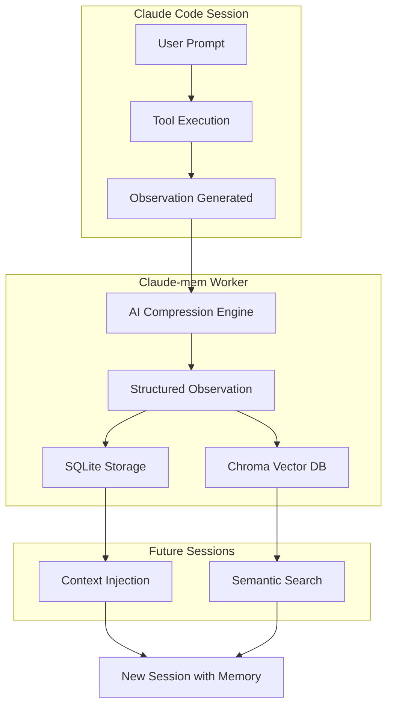
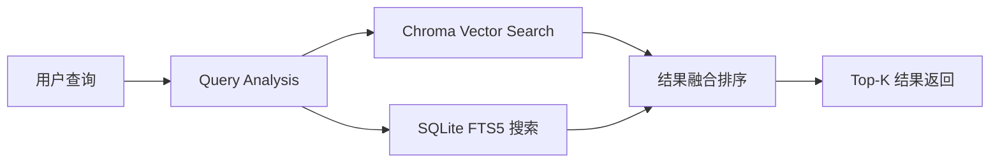
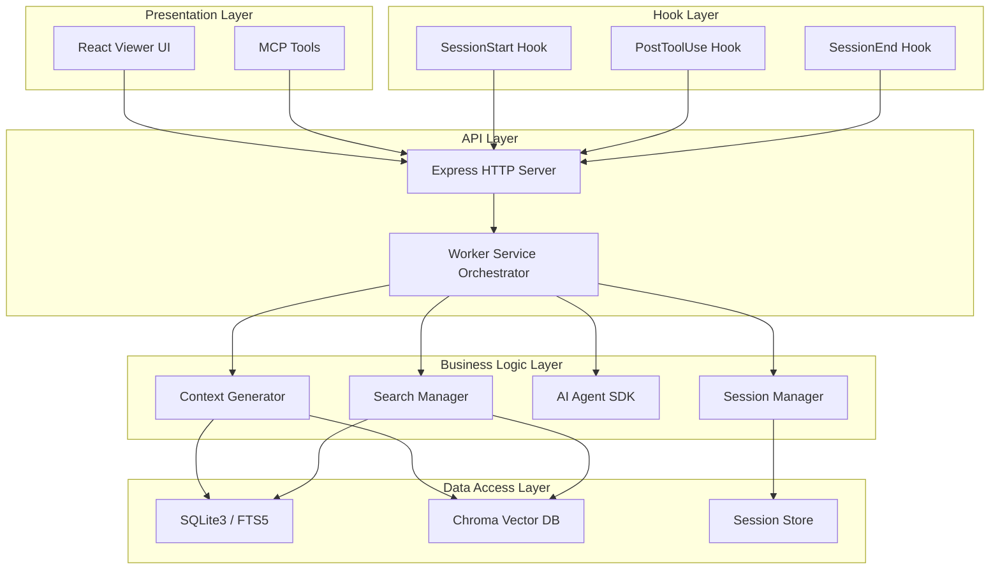

# 1、项目概述与核心价值

<details>
<summary>相关源文件</summary>

- README.md
- package.json
- src/services/worker-service.ts
- src/services/sync/ChromaSync.ts
- plugin/skills/mem-search/SKILL.md
- src/services/sqlite/Database.ts
- src/hooks/hook-response.ts
</details>

## 概述

Claude-mem 是一个专为 Claude Code 设计的**持久化内存压缩系统**，通过自动捕获工具使用观察、生成语义摘要，并使其在跨会话间可用，解决了 AI 助手在会话结束后"遗忘"项目上下文的根本问题。

项目采用 AGPL-3.0 开源协议，当前版本 10.5.5，代码规模约 15,000 行，包含 60+ 测试文件。核心技术栈涵盖 TypeScript/Node.js、Bun 运行时、Express HTTP 服务、SQLite3 持久化存储、Chroma 向量数据库和 React 前端界面。

---

## 一、项目简介

### 1.1 背景与问题

在使用 Claude Code 进行开发时，开发者面临一个核心痛点：**每次新会话都是一张白纸**。Claude 无法记住之前会话中的：

- 已做出的架构决策
- 修复过的 bug 及解决方案
- 项目特定的编码约定
- 已探索过的技术路径

这导致开发者需要在每个新会话中重复解释项目背景，严重影响开发效率。

### 1.2 解决方案

Claude-mem 通过在 **5 个关键生命周期钩子** 上植入数据捕获逻辑，实现了：

```
SessionStart ──→ 注入历史上下文
     ↓
UserPromptSubmit ──→ 捕获用户输入
     ↓
PostToolUse ──→ 分析工具调用结果
     ↓
Summary ──→ 生成会话摘要
     ↓
SessionEnd ──→ 持久化存储
```

### 1.3 核心数据流



---

## 二、核心价值

### 2.1 会话间记忆持久化

**技术实现**：通过 SQLite3 数据库存储所有观察记录，每个观察包含：

```typescript
interface StoredObservation {
  id: number;
  memory_session_id: string;
  project: string;
  type: string;           // bugfix | feature | decision | discovery | change
  title: string | null;
  subtitle: string | null;
  facts: string | null;   // JSON 数组
  narrative: string | null;
  concepts: string | null;
  files_read: string | null;
  files_modified: string | null;
  created_at_epoch: number;
}
```

**价值体现**：
- 项目知识跨会话保留，无需重复解释
- 支持多项目隔离，每个项目拥有独立的记忆空间
- 数据存储在本地 `~/.claude-mem/claude-mem.db`

### 2.2 AI 观察智能压缩

**技术实现**：使用 Claude Agent SDK 对原始工具输出进行语义压缩：

```typescript
// 原始工具输出可能包含数千 token
const rawOutput = toolResult.output; // 5000+ tokens

// AI 压缩为结构化观察
const compressed = await sdkAgent.compress({
  input: rawOutput,
  template: 'observation-extraction'
});
// 输出: ~200 tokens 的结构化摘要
```

**压缩效果**：
- 将工具调用输出压缩为结构化事实、概念、叙述
- 保留关键信息的同时减少 80-90% 的存储和传输开销
- 使用 YAML 格式存储，兼顾可读性和解析效率

### 2.3 语义搜索

**技术实现**：基于 Chroma 向量数据库的混合搜索架构



**核心能力**：
- **语义理解**：基于向量相似度，理解查询的意图而非仅匹配关键词
- **分层检索**：Search → Timeline → Get Observations 的三层工作流，节省 10x token
- **多维度过滤**：支持按类型、日期、项目、文件等多维度筛选

**代码示例**（MCP 搜索工具）：

```typescript
// Step 1: 搜索索引（~50-100 tokens/结果）
search(query="authentication bug", type="bugfix", limit=10)

// Step 2: 获取时间线上下文
timeline(anchor=11131, depth_before=3, depth_after=3)

// Step 3: 批量获取完整详情（~500-1000 tokens/结果）
get_observations(ids=[123, 456])
```

### 2.4 渐进式上下文披露

**设计理念**：不一次性注入所有历史，而是根据当前查询动态检索最相关的上下文

**实现机制**：

1. **会话启动时**：仅注入最近 N 个会话的高层摘要
2. **用户查询时**：自动触发语义搜索，注入相关观察
3. **工具使用时**：实时捕获并压缩新的观察

**配置示例**（`~/.claude-mem/settings.json`）：

```json
{
  "context_injection": {
    "max_observations_per_session": 10,
    "max_tokens_total": 4000,
    "include_summaries": true,
    "include_recent_files": true
  }
}
```

---

## 三、技术栈概览

### 3.1 架构分层



### 3.2 核心技术组件

| 层级 | 技术 | 用途 |
|------|------|------|
| **运行时** | Bun | JavaScript 运行时和进程管理 |
| **语言** | TypeScript / ESM | 类型安全、现代模块化 |
| **HTTP 服务** | Express | Worker API 和 Web 界面 |
| **关系数据库** | SQLite3 + FTS5 | 结构化数据存储和全文搜索 |
| **向量数据库** | Chroma | 语义搜索和向量相似度 |
| **前端** | React + React DOM | 实时内存流查看器 UI |
| **AI SDK** | @anthropic-ai/claude-agent-sdk | 观察压缩和摘要生成 |
| **MCP** | @modelcontextprotocol/sdk | 搜索工具集成 |

### 3.3 关键依赖版本

```json
{
  "dependencies": {
    "@anthropic-ai/claude-agent-sdk": "^0.1.76",
    "@modelcontextprotocol/sdk": "^1.25.1",
    "express": "^4.18.2",
    "react": "^18.3.1",
    "react-dom": "^18.3.1"
  },
  "engines": {
    "node": ">=18.0.0",
    "bun": ">=1.0.0"
  }
}
```

### 3.4 Worker 服务架构

Worker Service 采用**精简编排器模式**，将 2000 行单体代码重构为约 300 行的编排层：

```typescript
class WorkerService {
  // 基础设施层
  private server: Server;
  private dbManager: DatabaseManager;
  
  // 业务逻辑层
  private sessionManager: SessionManager;
  private searchManager: SearchManager;
  private sdkAgent: SDKAgent;
  
  // 集成层
  private chromaSync: ChromaSync;
  private sseBroadcaster: SSEBroadcaster;
  
  // 背景初始化，非阻塞启动
  private async initializeBackground(): Promise<void> {
    await this.dbManager.initialize();
    await this.initializeSearch();
    await this.connectMCP();
  }
}
```

---

## 四、典型使用场景

### 4.1 多会话项目开发

**场景描述**：开发者正在实现一个复杂功能，需要多个会话完成。

**Claude-mem 的作用**：

1. **会话 1**：设计数据库 Schema
   - 捕获：表结构设计、字段类型决策、索引策略
   - 存储为 "decision" 类型观察

2. **会话 2**：实现 API 端点
   - 自动注入：会话 1 的 Schema 决策
   - 捕获：端点路由设计、认证逻辑

3. **会话 3**：前端集成
   - 自动注入：前两会话的关键决策
   - Claude 理解完整的后端契约

**用户无需重复解释**："我们使用 PostgreSQL，users 表有 email 字段，API 使用 JWT 认证..."

### 4.2 长期项目维护

**场景描述**：项目持续数月，偶尔需要修复 bug 或添加功能。

**Claude-mem 的作用**：

```
用户: "上次我们怎么解决的权限问题？"
↓
自动触发 search(query="权限问题")
↓
返回：3个月前的 bugfix 观察 #4521
↓
Claude: "根据之前的记录（#4521），我们在 src/auth/middleware.ts 
        中修复了类似的权限问题，解决方案是..."
```

**知识积累**：每次修复都被结构化存储，形成可查询的知识库。

### 4.3 知识积累与复用

**场景描述**：跨项目复用解决方案或模式。

**Claude-mem 的能力**：

1. **概念标签**：观察自动提取 "concepts" 字段
   ```yaml
   concepts:
     - "rate-limiting"
     - "redis"
     - "middleware-pattern"
   ```

2. **文件关联**：记录读取和修改的文件
   ```yaml
   files_modified:
     - "src/middleware/rateLimiter.ts"
     - "src/config/redis.ts"
   ```

3. **跨项目搜索**：在 mem-search 中查询概念或文件模式
   ```
   "查找所有涉及 rate-limiting 的实现"
   → 返回项目 A、B、C 中的相关观察
   ```

### 4.4 团队协作场景

**场景描述**：多个开发者使用 Claude Code 处理同一项目。

**Claude-mem 的支持**：

- **共享观察库**：所有团队成员的操作都被记录
- **新人入职**：新成员可查询历史决策，快速理解项目背景
- **代码审查辅助**：查看某文件的修改历史和决策依据

---

## 五、快速开始

### 5.1 安装

```bash
# 在 Claude Code 会话中执行
/plugin marketplace add thedotmack/claude-mem
/plugin install claude-mem
```

### 5.2 验证安装

重启 Claude Code 后，访问 Web 界面：

```
http://localhost:37777
```

### 5.3 使用搜索

自然语言询问历史工作：

```
"我们上次怎么解决数据库连接池问题的？"
"显示最近对这个项目的修改"
"查找所有关于 API 认证的决策"
```

---

## 六、总结

Claude-mem 通过以下技术创新解决了 AI 助手上下文丢失的痛点：

| 核心能力 | 技术实现 | 用户价值 |
|----------|----------|----------|
| **持久化记忆** | SQLite + 结构化观察 | 跨会话保持项目知识 |
| **智能压缩** | Claude Agent SDK | 高效存储，减少 token 消耗 |
| **语义搜索** | Chroma 向量数据库 | 自然语言查询历史工作 |
| **渐进披露** | 分层上下文注入 | 自动提供相关信息 |

作为开源项目（AGPL-3.0），Claude-mem 不仅提供了强大的记忆能力，更展示了如何构建与 Claude Code 深度集成的插件系统，为 AI 辅助开发工具的生态建设提供了优秀范例。

---

**相关资源**：
- 官方文档：https://docs.claude-mem.ai
- GitHub：https://github.com/thedotmack/claude-mem
- 许可证：AGPL-3.0
