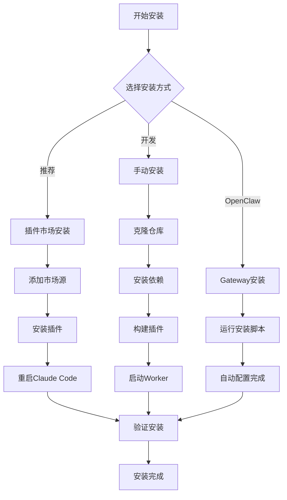
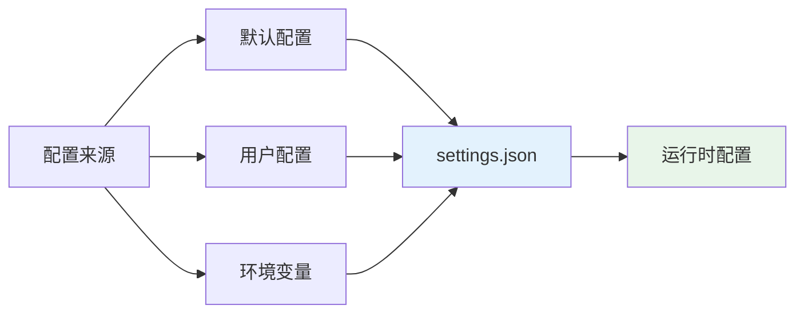
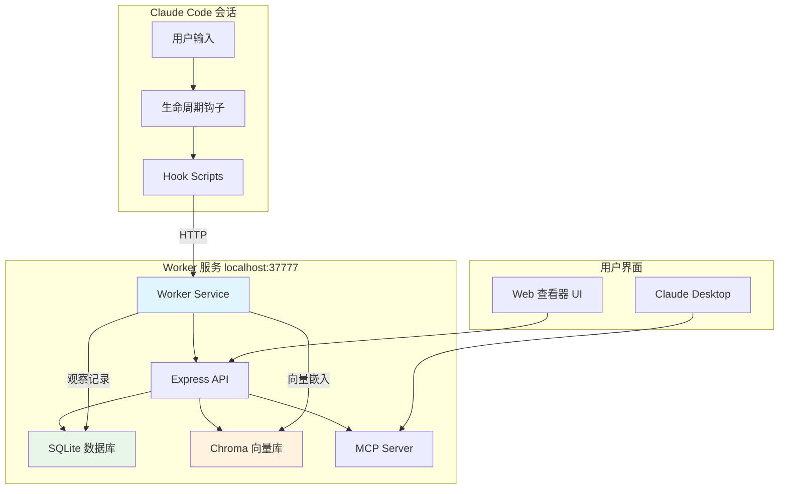
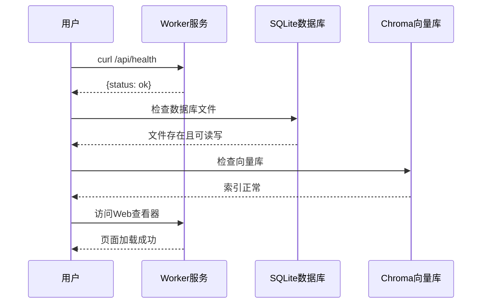
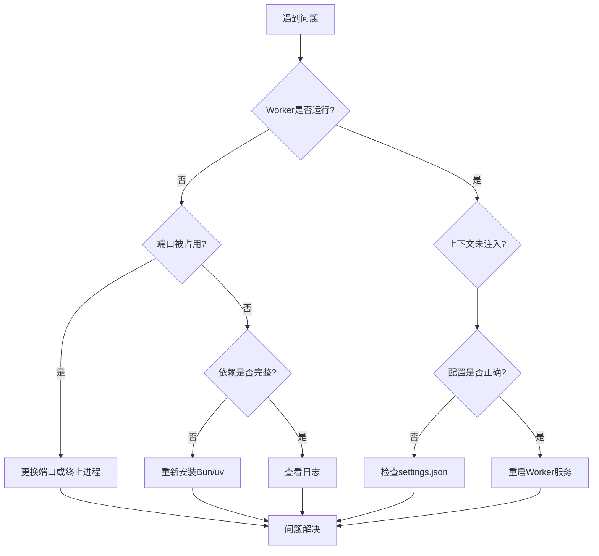

# 2、快速开始与安装配置

<details>
<summary>相关源文件</summary>

- README.md
- CLAUDE.md
- package.json
- plugin/.claude-plugin/plugin.json
- scripts/build-hooks.js
- plugin/skills/mem-search/SKILL.md

</details>

## 概述

Claude-mem 是一款为 Claude Code 设计的持久化记忆插件，能够自动捕获工具使用记录、压缩观察结果，并将相关上下文注入到未来的会话中。本指南将帮助您快速完成从环境准备到首次运行的完整流程。

**核心特性：**
- 🧠 **跨会话记忆** - 会话结束后上下文仍然保留
- 🔍 **语义搜索** - 通过自然语言查询历史工作记录
- 🖥️ **Web 查看器** - 实时查看记忆流（http://localhost:37777）
- 🔒 **隐私控制** - 使用 `<private>` 标签排除敏感内容
- 🤖 **自动运行** - 无需手动干预

---

## 前提条件

在安装 Claude-mem 之前，请确保您的系统满足以下要求：

### 系统要求

| 组件 | 版本要求 | 说明 |
|------|----------|------|
| **Node.js** | ≥18.0.0 | JavaScript 运行时环境 |
| **Bun** | ≥1.0.0 | 高性能 JavaScript 运行时（自动安装） |
| **uv** | 最新版 | Python 包管理器（自动安装） |
| **Claude Code** | 最新版 | 必须支持插件功能 |
| **SQLite 3** | 捆绑版 | 持久化存储（已包含） |

### 验证环境

```bash
# 检查 Node.js 版本
node --version
# 应显示 v18.0.0 或更高版本

# 检查 Claude Code
code --version
# 确保已安装并支持插件功能
```

### 操作系统支持

- ✅ macOS (Intel/Apple Silicon)
- ✅ Linux (Ubuntu/Debian/CentOS)
- ✅ Windows (需配置 PATH 环境变量)

> **Windows 用户注意：** 如果遇到 `npm : The term 'npm' is not recognized` 错误，请从 [nodejs.org](https://nodejs.org) 下载 Node.js 安装包，并在安装后重启终端。

---

## 安装步骤

### 安装流程概览



### 方式一：通过 Claude Code 插件市场安装（推荐）

这是最简便的安装方式，适合大多数用户：

```bash
# 1. 启动新的 Claude Code 会话
claude

# 2. 添加插件市场源
/plugin marketplace add thedotmack/claude-mem

# 3. 安装插件
/plugin install claude-mem
```

**安装完成后：**
1. 重启 Claude Code
2. 插件将自动初始化并在后台运行
3. 历史会话的上下文会自动出现在新会话中

### 方式二：手动安装（开发者/高级用户）

如果您需要自定义配置或参与开发，可以选择手动安装：

```bash
# 1. 克隆仓库
git clone https://github.com/thedotmack/claude-mem.git
cd claude-mem

# 2. 安装依赖
npm install

# 3. 构建插件
npm run build

# 4. 同步到插件市场目录
npm run sync-marketplace

# 5. 启动 Worker 服务
npm run worker:start
```

### 方式三：OpenClaw Gateway 安装

对于 OpenClaw 网关用户，可使用一键安装脚本：

```bash
curl -fsSL https://install.cmem.ai/openclaw.sh | bash
```

该脚本会自动处理依赖、插件设置、AI 提供商配置、Worker 启动等所有步骤。

---

## 基础配置

### 配置文件位置

Claude-mem 的配置文件位于：

```
~/.claude-mem/settings.json
```

**文件自动创建**：首次运行时会自动生成默认配置文件，无需手动创建。

### 默认配置示例

```json
{
  "ai": {
    "model": "claude-sonnet-4-20250514",
    "maxTokens": 4000,
    "temperature": 0.3
  },
  "worker": {
    "port": 37777,
    "host": "localhost"
  },
  "storage": {
    "dataDir": "~/.claude-mem",
    "database": "~/.claude-mem/claude-mem.db",
    "chromaDir": "~/.claude-mem/chroma"
  },
  "context": {
    "injectionEnabled": true,
    "maxObservations": 50,
    "maxTokens": 8000
  },
  "logging": {
    "level": "info",
    "dir": "~/.claude-mem/logs"
  }
}
```

### 配置层级与优先级



**优先级顺序：** 环境变量 > 用户配置 > 默认配置

### 自定义配置项

#### AI 模型配置

| 配置项 | 类型 | 默认值 | 说明 |
|--------|------|--------|------|
| `ai.model` | string | `claude-sonnet-4-20250514` | 使用的 AI 模型 |
| `ai.maxTokens` | number | `4000` | 生成摘要的最大 Token 数 |
| `ai.temperature` | number | `0.3` | 生成温度（0-1） |

#### Worker 服务配置

| 配置项 | 类型 | 默认值 | 说明 |
|--------|------|--------|------|
| `worker.port` | number | `37777` | Worker HTTP API 端口 |
| `worker.host` | string | `localhost` | 绑定主机地址 |

#### 上下文注入配置

| 配置项 | 类型 | 默认值 | 说明 |
|--------|------|--------|------|
| `context.injectionEnabled` | boolean | `true` | 是否启用上下文注入 |
| `context.maxObservations` | number | `50` | 每次注入的最大观察数 |
| `context.maxTokens` | number | `8000` | 上下文最大 Token 数 |

#### 隐私配置

```json
{
  "privacy": {
    "stripPrivateTags": true,
    "defaultPrivatePatterns": [
      "password",
      "secret",
      "token",
      "api_key"
    ]
  }
}
```

### 编辑配置文件

使用任意文本编辑器打开并修改配置：

```bash
# 使用 VS Code
code ~/.claude-mem/settings.json

# 使用 Vim
vim ~/.claude-mem/settings.json

# 使用 Nano
nano ~/.claude-mem/settings.json
```

**修改后需要重启 Worker 服务生效：**

```bash
cd ~/.claude/plugins/marketplaces/thedotmack
npm run worker:restart
```

---

## 首次运行

### 安装后系统架构

安装完成后，系统组件之间的关系如下图所示：



### 1. 启动 Worker 服务

如果 Worker 未自动启动，可手动启动：

```bash
# 进入插件目录
cd ~/.claude/plugins/marketplaces/thedotmack

# 启动 Worker
npm run worker:start

# 或使用 Bun 直接运行
bun plugin/scripts/worker-service.cjs start
```

### 2. 验证服务状态

```bash
# 检查 Worker 状态
npm run worker:status

# 预期输出：
# ✅ Worker is running (PID: 12345)
# 📊 Port: 37777
# 💾 Database: ~/.claude-mem/claude-mem.db
```

### 3. 查看实时日志

```bash
# 查看最近 50 行日志
npm run worker:logs

# 实时跟踪日志输出
npm run worker:tail
```

### 4. 访问查看器 UI

打开浏览器访问：

```
http://localhost:37777
```

**查看器功能：**
- 📊 **记忆流** - 实时显示所有观察记录
- 🔍 **搜索** - 按关键词、类型、时间过滤
- 📅 **时间线** - 按时间顺序查看历史
- ⚙️ **设置** - 管理配置和切换版本

### 5. 执行首次搜索测试

在 Claude Code 会话中测试记忆功能：

```
# 尝试搜索之前的会话记录
"我们上次是如何解决那个认证问题的？"
```

Claude 会自动调用 `mem-search` skill 进行搜索。

### 6. 验证安装成功

执行以下检查确认安装正确：

**验证流程图：**



```bash
# 1. 检查进程是否在运行
curl http://localhost:37777/api/health

# 预期响应：
# {"status":"ok","version":"10.5.5"}

# 2. 检查数据库文件
ls -lh ~/.claude-mem/claude-mem.db

# 3. 查看最近会话
ls -lt ~/.claude-mem/sessions/ | head -5
```

---

## 常用命令速查

### Worker 管理

```bash
# 启动 Worker
npm run worker:start

# 停止 Worker
npm run worker:stop

# 重启 Worker
npm run worker:restart

# 查看状态
npm run worker:status
```

### 构建与同步

```bash
# 构建插件
npm run build

# 构建并同步到市场
npm run build-and-sync

# 强制同步
npm run sync-marketplace:force
```

### 测试

```bash
# 运行所有测试
npm test

# 运行特定测试套件
npm run test:sqlite
npm run test:search
npm run test:agents
```

---

## 常见问题排查

### 问题诊断流程



### 问题 1：Worker 无法启动

**症状：**
```
❌ Worker failed to start
Error: Port 37777 is already in use
```

**解决方案：**
```bash
# 1. 查找占用端口的进程
lsof -i :37777

# 2. 终止占用进程
kill -9 <PID>

# 3. 或使用不同端口（修改 settings.json）
```

### 问题 2：Bun 未安装

**症状：**
```
/bin/sh: bun: command not found
```

**解决方案：**
```bash
# 自动安装 Bun
curl -fsSL https://bun.sh/install | bash

# 添加 PATH（根据 shell 类型）
export PATH="$HOME/.bun/bin:$PATH"

# 验证安装
bun --version
```

### 问题 3：依赖安装失败

**症状：**
```
npm ERR! code ECONNREFUSED
```

**解决方案：**
```bash
# 1. 使用镜像源
npm config set registry https://registry.npmmirror.com

# 2. 清理缓存
npm cache clean --force

# 3. 重新安装
rm -rf node_modules
npm install
```

### 问题 4：上下文未注入

**症状：** 新会话没有显示历史上下文

**解决方案：**
```bash
# 1. 检查配置
 cat ~/.claude-mem/settings.json | grep injectionEnabled

# 2. 确保为 true，然后重启
npm run worker:restart

# 3. 检查日志是否有错误
npm run worker:logs
```

### 问题 5：权限错误

**症状：**
```
EACCES: permission denied, open '~/.claude-mem/settings.json'
```

**解决方案：**
```bash
# 修复目录权限
chmod -R 755 ~/.claude-mem
chmod 644 ~/.claude-mem/settings.json

# 或重新创建目录
rm -rf ~/.claude-mem
mkdir -p ~/.claude-mem/logs
```

### 问题 6：Chroma 向量数据库错误

**症状：**
```
Chroma init failed: Python module not found
```

**解决方案：**
```bash
# 1. 确保 uv 已安装
curl -LsSf https://astral.sh/uv/install.sh | sh

# 2. 重新安装 Python 依赖
uv pip install chromadb

# 3. 重启 Worker
npm run worker:restart
```

---

## 文件位置速查

| 类型 | 路径 | 说明 |
|------|------|------|
| **配置文件** | `~/.claude-mem/settings.json` | 用户配置 |
| **数据库** | `~/.claude-mem/claude-mem.db` | SQLite 主数据库 |
| **向量存储** | `~/.claude-mem/chroma/` | Chroma 向量数据库 |
| **日志文件** | `~/.claude-mem/logs/worker-YYYY-MM-DD.log` | Worker 运行日志 |
| **插件目录** | `~/.claude/plugins/marketplaces/thedotmack/` | 安装后的插件文件 |
| **源代码** | `<project-root>/src/` | TypeScript 源码 |
| **构建输出** | `<project-root>/plugin/` | 构建后的插件文件 |

---

## 下一步

完成安装后，您可以：

1. **阅读完整文档** - 访问 [docs.claude-mem.ai](https://docs.claude-mem.ai)
2. **探索搜索功能** - 学习使用 `mem-search` skill 查询历史
3. **查看架构文档** - 了解系统内部工作原理
4. **参与开发** - 阅读 [Development Guide](https://docs.claude-mem.ai/development)

---

**祝您使用愉快！如有问题，请访问 [GitHub Issues](https://github.com/thedotmack/claude-mem/issues) 获取支持。**
