# 3、核心概念与术语体系

<details>
<summary>相关源文件</summary>

- src/services/sqlite/sessions/types.ts
- src/services/sqlite/observations/types.ts
- src/services/sqlite/summaries/types.ts
- src/services/sqlite/types.ts
- src/utils/tag-stripping.ts
- src/sdk/parser.ts
- src/services/context/ContextBuilder.ts
- src/services/context/TokenCalculator.ts
- src/services/domain/ModeManager.ts
- src/services/worker/search/filters/TypeFilter.ts

</details>

## 概述

Claude-mem 是一个为 Claude Code 提供持久记忆能力的插件系统。本文档深入解析其核心概念与术语体系，帮助开发者理解系统的数据模型、处理流程和架构设计。掌握这些概念是理解和扩展 Claude-mem 功能的基础。

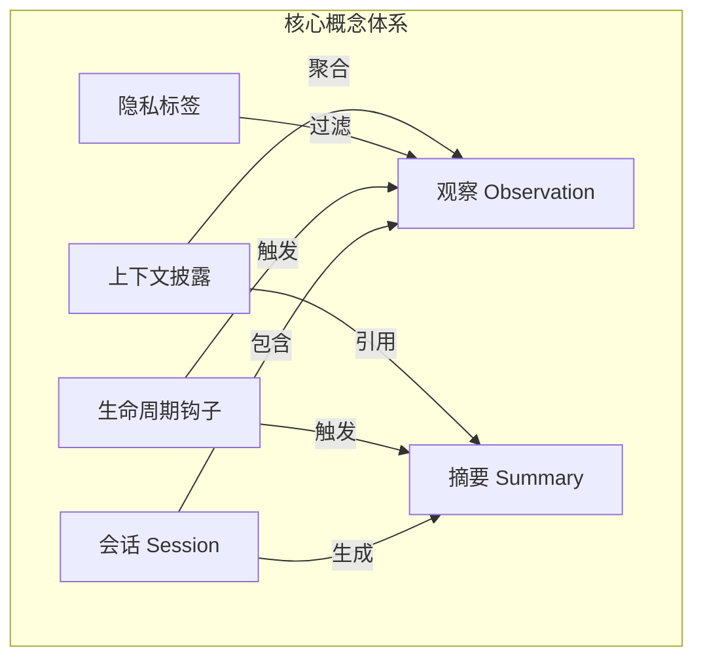

## 会话 (Session)

### 概念定义

**会话**是 Claude-mem 中最核心的概念，代表一次与 Claude Code 的完整交互周期。每个会话对应用户在终端中启动 Claude Code 到退出的整个过程。

Claude-mem 采用**双会话 ID 架构**来区分不同层面的标识：

- **content_session_id**: Claude Code 内容系统分配的会话标识
- **memory_session_id**: Claude-mem 内部使用的记忆会话标识（可能包含分支信息）

### 会话类型定义

```typescript
// src/services/sqlite/sessions/types.ts

/**
 * 基础会话信息（最小字段集）
 */
export interface SessionBasic {
  id: number;                          // 数据库主键
  content_session_id: string;          // Claude Code 内容会话 ID
  memory_session_id: string | null;    // 记忆会话 ID（可为空）
  project: string;                     // 所属项目
  user_prompt: string;                 // 用户初始提示
  custom_title: string | null;         // 自定义标题
}

/**
 * 完整会话记录（含时间戳）
 */
export interface SessionFull {
  id: number;
  content_session_id: string;
  memory_session_id: string;
  project: string;
  user_prompt: string;
  custom_title: string | null;
  started_at: string;                  // ISO 格式开始时间
  started_at_epoch: number;            // 纪元时间戳（毫秒）
  completed_at: string | null;         // 完成时间
  completed_at_epoch: number | null;
  status: string;                      // active | completed | failed
}

/**
 * 带摘要状态的会话
 */
export interface SessionWithStatus {
  memory_session_id: string | null;
  status: string;
  started_at: string;
  user_prompt: string | null;
  has_summary: boolean;                // 是否已生成摘要
}
```

### 会话生命周期

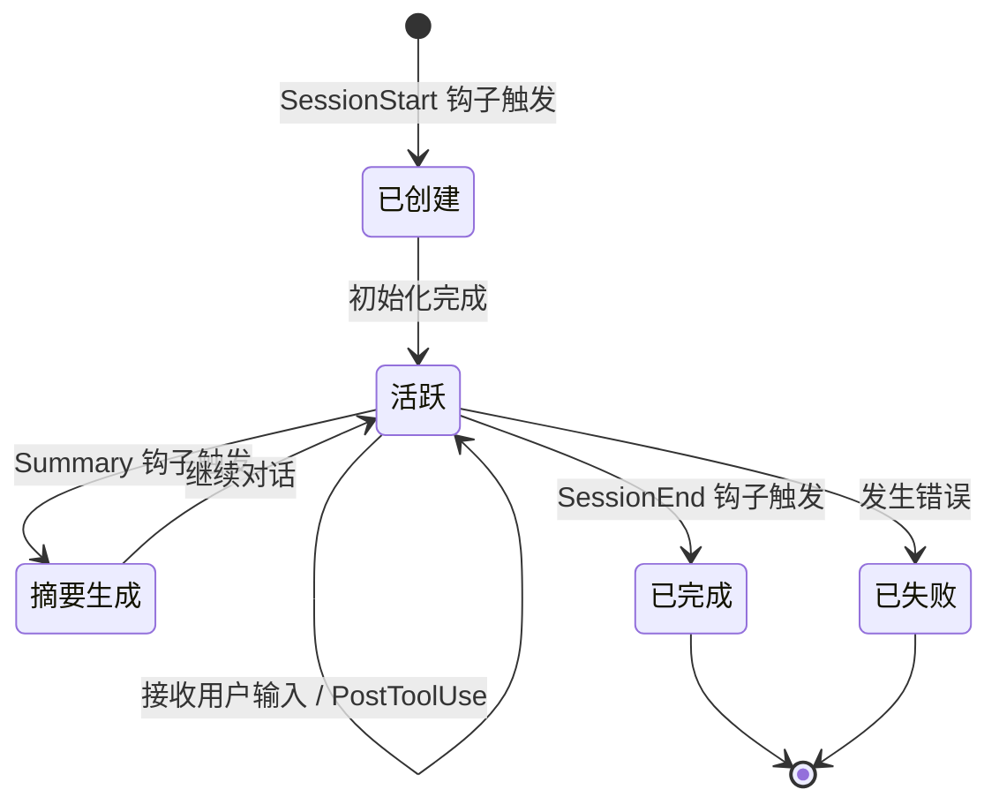

### 会话状态管理

会话状态由 `status` 字段管理，包含三种状态：

| 状态 | 含义 | 转换条件 |
|------|------|----------|
| `active` | 会话进行中 | SessionStart 后初始化完成 |
| `completed` | 正常完成 | SessionEnd 钩子成功执行 |
| `failed` | 发生错误 | 处理过程中出现异常 |

会话的**幂等创建**机制确保同一 `content_session_id` 不会创建重复记录（使用 `INSERT OR IGNORE` 模式）。

## 观察 (Observation)

### 概念定义

**观察**是 Claude-mem 记录的基本信息单元，代表 AI 在工作过程中产生的有价值洞察。每个观察都是一个结构化的知识片段，包含类型、标题、事实、概念等元数据。

### 观察数据结构

```typescript
// src/services/sqlite/types.ts

export interface ObservationRow {
  id: number;
  memory_session_id: string;
  project: string;
  text: string | null;                 // 原始文本内容（可为空）
  type: 'decision' | 'bugfix' | 'feature' | 'refactor' | 'discovery' | 'change';
  title: string | null;                // 观察标题
  subtitle: string | null;             // 副标题
  facts: string | null;                // JSON 数组格式的事实列表
  narrative: string | null;            // 叙述性描述
  concepts: string | null;             // JSON 数组格式的概念标签
  files_read: string | null;           // JSON 数组格式的读取文件列表
  files_modified: string | null;       // JSON 数组格式的修改文件列表
  prompt_number: number | null;        // 提示序号
  discovery_tokens: number;            // 发现此观察消耗的 Token 数（ROI 指标）
  created_at: string;                  // ISO 格式创建时间
  created_at_epoch: number;            // 纪元时间戳
}
```

### 观察输入类型

```typescript
// src/services/sqlite/observations/types.ts

export interface ObservationInput {
  type: string;
  title: string | null;
  subtitle: string | null;
  facts: string[];
  narrative: string | null;
  concepts: string[];
  files_read: string[];
  files_modified: string[];
}
```

### 观察类型体系

Claude-mem 支持六种核心观察类型，每种类型对应不同的工作场景：

```typescript
// src/services/worker/search/filters/TypeFilter.ts

type ObservationType = 'decision' | 'bugfix' | 'feature' | 'refactor' | 'discovery' | 'change';

export const OBSERVATION_TYPES: ObservationType[] = [
  'decision',    // 架构决策、设计选择
  'bugfix',      // Bug 修复记录
  'feature',     // 功能实现
  'refactor',    // 代码重构
  'discovery',   // 探索发现
  'change'       // 一般变更
];
```

| 类型 | 用途 | Emoji 标识 |
|------|------|-----------|
| `decision` | 记录架构决策和设计选择 | 🎯 |
| `bugfix` | 记录 Bug 修复过程和方案 | 🐛 |
| `feature` | 记录新功能实现 | ✨ |
| `refactor` | 记录代码重构活动 | ♻️ |
| `discovery` | 记录探索和发现 | 🔍 |
| `change` | 一般性变更记录 | 📝 |

### 观察解析流程

观察从 AI 响应中通过 XML 格式解析提取：

```typescript
// src/sdk/parser.ts

export interface ParsedObservation {
  type: string;
  title: string | null;
  subtitle: string | null;
  facts: string[];
  narrative: string | null;
  concepts: string[];
  files_read: string[];
  files_modified: string[];
}

// 解析示例 XML 格式：
// <observation>
//   <type>discovery</type>
//   <title>发现性能瓶颈</title>
//   <facts>
//     <fact>数据库查询耗时超过 2s</fact>
//     <fact>缺少索引导致全表扫描</fact>
//   </facts>
//   <concepts>
//     <concept>性能优化</concept>
//     <concept>数据库索引</concept>
//   </concepts>
// </observation>
```

### 观察生成流程

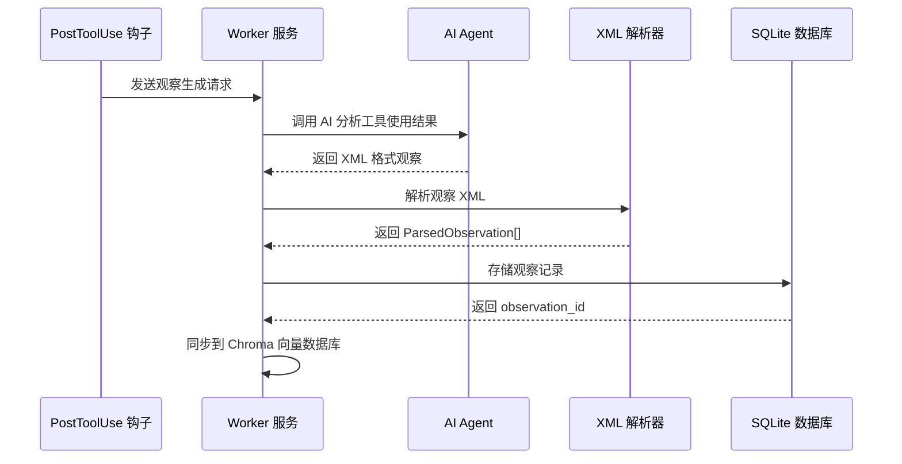

## 摘要 (Summary)

### 概念定义

**摘要**是会话结束时生成的结构化总结，概括整个会话的核心内容。与会话中持续产生的观察不同，摘要在 SessionEnd 或 Summary 钩子触发时生成，提供会话级别的全景视图。

### 摘要数据结构

```typescript
// src/services/sqlite/types.ts

export interface SessionSummaryRow {
  id: number;
  memory_session_id: string;
  project: string;
  request: string | null;              // 用户原始请求
  investigated: string | null;         // 调查内容
  learned: string | null;              // 学到的知识
  completed: string | null;            // 完成的工作
  next_steps: string | null;           // 下一步行动
  files_read: string | null;           // 读取的文件列表（JSON）
  files_edited: string | null;         // 编辑的文件列表（JSON）
  notes: string | null;                // 额外备注
  prompt_number: number | null;        // 提示序号
  discovery_tokens: number;            // 会话累计 Token 消耗（ROI 指标）
  created_at: string;
  created_at_epoch: number;
}
```

### 摘要输入类型

```typescript
// src/services/sqlite/summaries/types.ts

export interface SummaryInput {
  request: string;                     // 用户请求
  investigated: string;                // 调查内容
  learned: string;                     // 学到的知识
  completed: string;                   // 完成的工作
  next_steps: string;                  // 下一步
  notes: string | null;                // 备注（可选）
}
```

### 摘要解析

```typescript
// src/sdk/parser.ts

export interface ParsedSummary {
  request: string | null;
  investigated: string | null;
  learned: string | null;
  completed: string | null;
  next_steps: string | null;
  notes: string | null;
}

// 解析示例 XML 格式：
// <summary>
//   <request>优化数据库查询性能</request>
//   <investigated>分析了慢查询日志和索引使用情况</investigated>
//   <learned>缺少复合索引导致全表扫描</learned>
//   <completed>添加了 (user_id, created_at) 复合索引</completed>
//   <next_steps>监控性能指标，必要时进一步优化</next_steps>
// </summary>
```

### 摘要生成时机

摘要可以在以下时机生成：

1. **Summary 钩子**: 显式触发的摘要生成
2. **SessionEnd 钩子**: 会话结束时自动生成
3. **跳过摘要**: 使用 `<skip_summary reason="..."/>` 标记跳过

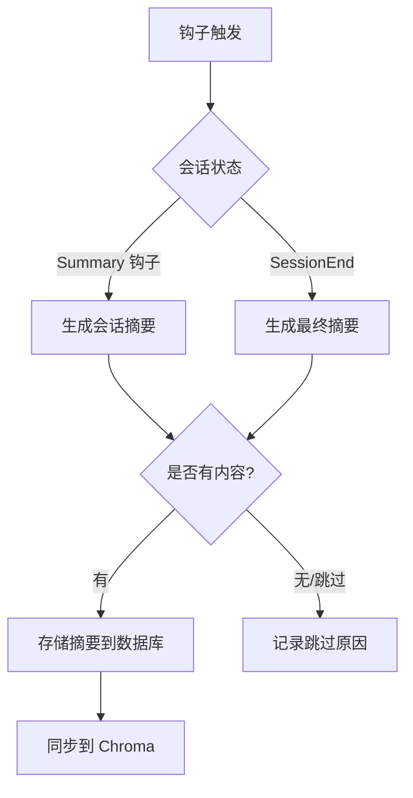

### 摘要与会话的关系

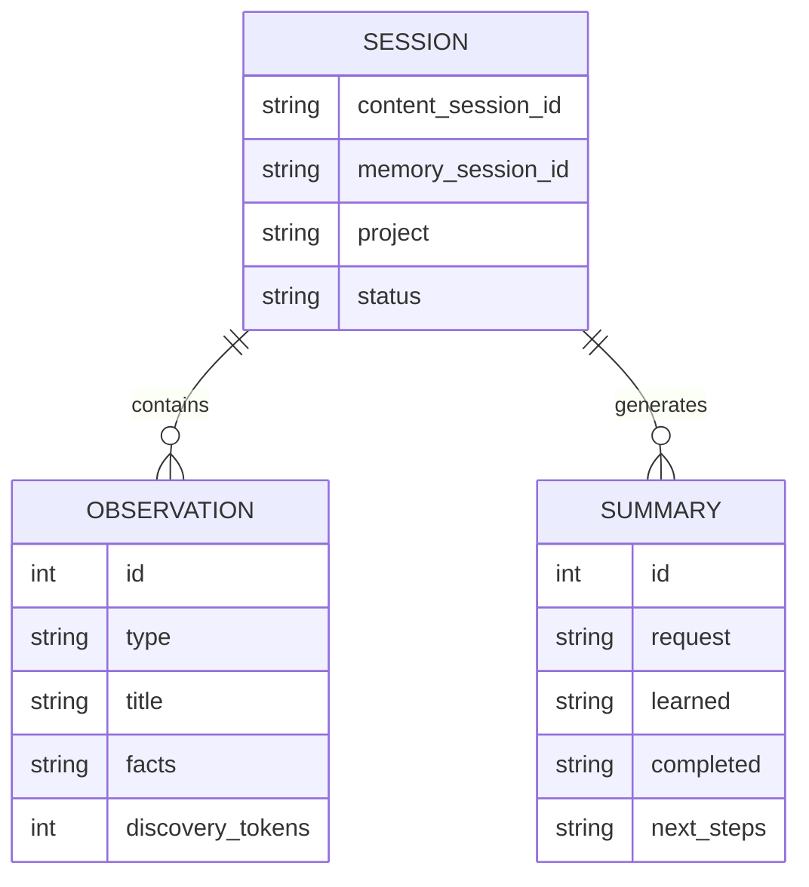

## 生命周期钩子

### 钩子架构概述

Claude-mem 实现了**5 个生命周期钩子**，在 Claude Code 会话的不同阶段触发：

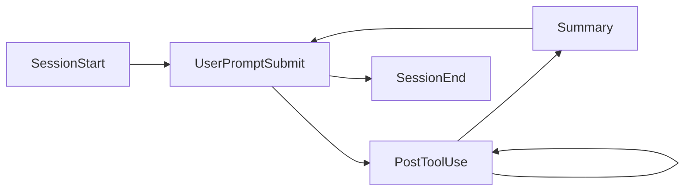

### 钩子详细说明

| 钩子 | 触发时机 | 主要职责 |
|------|----------|----------|
| **SessionStart** | 会话启动时 | 初始化会话记录，注入历史上下文 |
| **UserPromptSubmit** | 用户提交输入时 | 记录用户提示，触发预处理 |
| **PostToolUse** | 工具使用后 | 分析工具结果，生成观察 |
| **Summary** | 显式摘要请求时 | 生成会话摘要 |
| **SessionEnd** | 会话结束时 | 完成会话，生成最终摘要 |

### 钩子标准响应

```typescript
// src/hooks/hook-response.ts

export const STANDARD_HOOK_RESPONSE = JSON.stringify({
  continue: true,       // 是否继续处理
  suppressOutput: true  // 是否抑制钩子输出
});
```

### SessionStart 钩子

SessionStart 是特殊的钩子，它：

1. 启动 Worker 服务（如未运行）
2. 创建新的会话记录
3. **注入历史上下文**到 Claude Code

上下文注入使用 `<claude-mem-context>` 标签包装，这是系统级标签，用于：
- 防止递归存储（上下文中的内容不会被再次存储）
- 标识自动注入的观察内容

### PostToolUse 钩子

PostToolUse 是最繁忙的钩子，负责：

1. 接收工具使用结果
2. 调用 AI Agent 分析结果
3. 解析并存储观察
4. 广播新观察事件到 UI

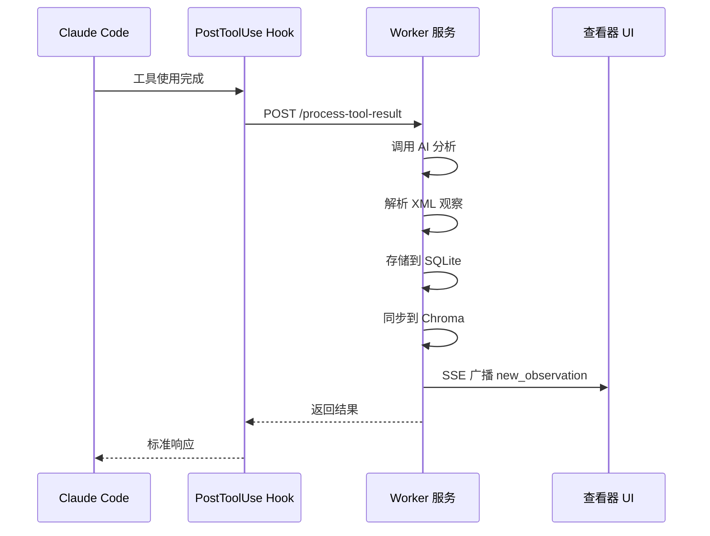

## 隐私标签系统

### 双标签架构

Claude-mem 实现了**双标签隐私系统**：

```mermaid
graph TB
    subgraph "标签层级"
        System[系统级标签<br/>&lt;claude-mem-context&gt;]
        User[用户级标签<br/>&lt;private&gt;]
    end
    
    subgraph "处理方式"
        Auto[自动注入<br/>防止递归]
        Manual[用户标记<br/>手动隐私控制]
    end
    
    System --> Auto
    User --> Manual
    
    subgraph "处理位置"
        Edge[边缘处理<br/>Hook 层过滤]
        Storage[存储层]
    end
    
        Auto --> Edge
    Manual --> Edge
    end
```

### 标签说明

| 标签 | 级别 | 用途 | 处理方式 |
|------|------|------|----------|
| `<claude-mem-context>` | 系统级 | 标识自动注入的上下文 | 防止递归存储 |
| `<private>` | 用户级 | 用户手动标记隐私内容 | 完全过滤不存储 |

### 标签剥离实现

```typescript
// src/utils/tag-stripping.ts

/**
 * 双标签系统用于元观察控制：
 * 1. <claude-mem-context> - 系统级标签，用于自动注入的观察
 *    （防止上下文注入激活时的递归存储）
 * 2. <private> - 用户级标签，用于手动隐私控制
 *    （允许用户标记不想持久化的内容）
 *
 * 边缘处理模式：在 Hook 层过滤后再发送到 Worker/存储。
 * 这保持了 Worker 服务的简单性，遵循单向数据流。
 */

const MAX_TAG_COUNT = 100;  // ReDoS 防护

function stripTagsInternal(content: string): string {
  // ReDoS 防护：限制标签数量
  const tagCount = countTags(content);
  if (tagCount > MAX_TAG_COUNT) {
    logger.warn('SYSTEM', 'tag count exceeds limit', {
      tagCount,
      maxAllowed: MAX_TAG_COUNT
    });
  }

  return content
    .replace(/<claude-mem-context>[\s\S]*?<\/claude-mem-context>/g, '')
    .replace(/<private>[\s\S]*?<\/private>/g, '')
    .trim();
}

export function stripMemoryTagsFromJson(content: string): string {
  return stripTagsInternal(content);
}

export function stripMemoryTagsFromPrompt(content: string): string {
  return stripTagsInternal(content);
}
```

### 安全考虑

1. **ReDoS 防护**: 限制最大标签数量为 100，防止恶意输入导致正则表达式灾难性回溯
2. **边缘处理**: 标签过滤在 Hook 层完成，避免敏感数据到达 Worker
3. **单向数据流**: 过滤后的数据不再恢复原状

### 使用示例

```xml
<!-- 用户可以在提示中使用 private 标签 -->
<private>
  这是敏感信息，不会被存储到记忆中。
  比如：密码、API 密钥、个人信息等。
</private>

<!-- 系统会自动注入上下文 -->
<claude-mem-context>
  [之前会话的观察内容...]
</claude-mem-context>
```

## 渐进式上下文披露

### 概念定义

**渐进式上下文披露**是 Claude-mem 的核心特性，它根据 Token 预算智能地决定向 Claude 展示多少历史观察内容。这不是简单的截断，而是基于 ROI（投资回报率）的经济学决策。

### Token 经济学模型

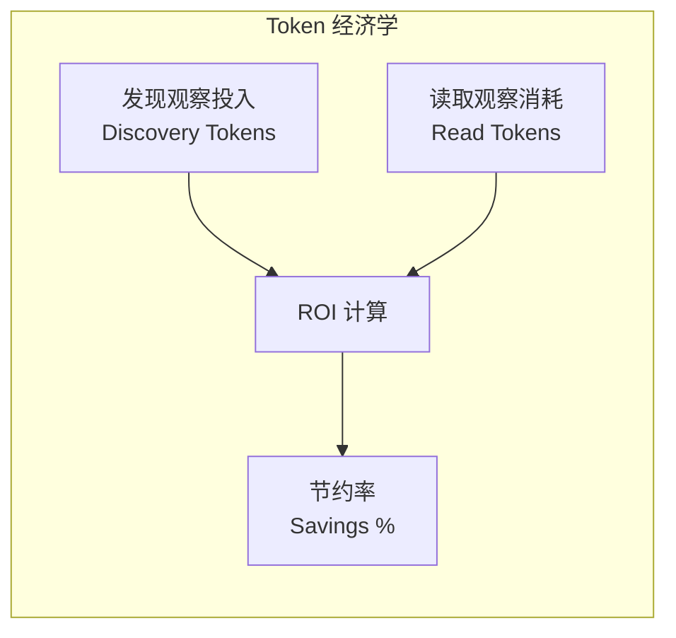

每个观察记录了两个关键指标：

- **discovery_tokens**: 当初发现/创建这个观察时投入的 Token 数
- **read_tokens**: 现在读取这个观察需要消耗的 Token 数

### Token 计算实现

```typescript
// src/services/context/TokenCalculator.ts

import { CHARS_PER_TOKEN_ESTIMATE } from './types.js';

// 假设每个 Token 约 4 个字符
export const CHARS_PER_TOKEN_ESTIMATE = 4;

/**
 * 计算单个观察的 Token 数
 */
export function calculateObservationTokens(obs: Observation): number {
  const obsSize = (obs.title?.length || 0) +
                  (obs.subtitle?.length || 0) +
                  (obs.narrative?.length || 0) +
                  JSON.stringify(obs.facts || []).length;
  return Math.ceil(obsSize / CHARS_PER_TOKEN_ESTIMATE);
}

/**
 * 计算上下文经济学
 */
export function calculateTokenEconomics(observations: Observation[]): TokenEconomics {
  const totalObservations = observations.length;

  const totalReadTokens = observations.reduce((sum, obs) => {
    return sum + calculateObservationTokens(obs);
  }, 0);

  const totalDiscoveryTokens = observations.reduce((sum, obs) => {
    return sum + (obs.discovery_tokens || 0);
  }, 0);

  const savings = totalDiscoveryTokens - totalReadTokens;
  const savingsPercent = totalDiscoveryTokens > 0
    ? Math.round((savings / totalDiscoveryTokens) * 100)
    : 0;

  return {
    totalObservations,
    totalReadTokens,
    totalDiscoveryTokens,
    savings,
    savingsPercent,
  };
}
```

### 上下文生成流程

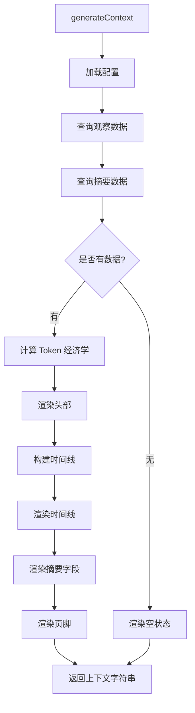

### 上下文配置

```typescript
// src/services/context/types.ts

export interface ContextConfig {
  // 显示数量
  totalObservationCount: number;   // 观察总数显示
  fullObservationCount: number;    // 完整展示数量
  sessionCount: number;            // 显示会话数

  // Token 显示开关
  showReadTokens: boolean;         // 显示读取 Token
  showWorkTokens: boolean;         // 显示工作 Token
  showSavingsAmount: boolean;      // 显示节约数量
  showSavingsPercent: boolean;     // 显示节约百分比

  // 过滤器
  observationTypes: Set<string>;   // 类型过滤
  observationConcepts: Set<string>; // 概念过滤

  // 显示选项
  fullObservationField: 'narrative' | 'facts';  // 完整显示字段
  showLastSummary: boolean;        // 显示最近摘要
  showLastMessage: boolean;        // 显示最近消息
}
```

### 披露策略

上下文披露采用**分层策略**：

1. **头部区域**: 显示项目信息、Token 经济学概览
2. **时间线区域**: 按时间顺序显示观察摘要（可配置数量）
3. **完整观察**: 选定的观察显示完整内容（narrative 或 facts）
4. **摘要区域**: 显示最近会话的结构化摘要
5. **页脚区域**: 显示 Token 统计和导航提示

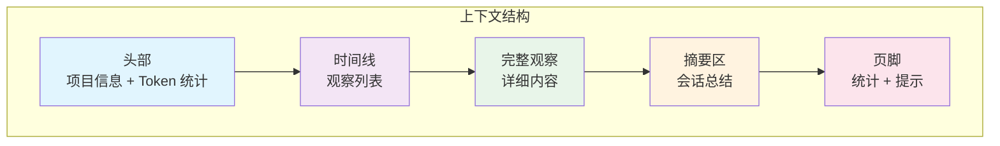

### 模式管理

上下文披露的内容由**模式（Mode）**决定，模式定义了：

- 观察类型体系
- 概念标签体系
- 提示词模板
- Emoji 标识

```typescript
// src/services/domain/ModeManager.ts

export class ModeManager {
  private activeMode: ModeConfig | null = null;
  
  // 支持模式继承（parent--override 模式）
  loadMode(modeId: string): ModeConfig {
    // 解析继承模式：code--ko 继承 code
    const inheritance = this.parseInheritance(modeId);
    
    if (inheritance.hasParent) {
      // 加载父模式并合并覆盖配置
      const parentMode = this.loadModeFile(inheritance.parentId);
      const overrideConfig = this.loadModeFile(inheritance.overrideId);
      return this.deepMerge(parentMode, overrideConfig);
    }
    
    return this.loadModeFile(modeId);
  }
  
  getTypeIcon(typeId: string): string {
    const type = this.getObservationTypes().find(t => t.id === typeId);
    return type?.emoji || '📝';
  }
  
  getWorkEmoji(typeId: string): string {
    const type = this.getObservationTypes().find(t => t.id === typeId);
    return type?.work_emoji || '📝';
  }
}
```

默认模式为 `code`（软件开发模式），支持通过 `CLAUDE_MEM_MODE` 环境变量切换。

## 总结

Claude-mem 的核心概念体系构建了一个完整的记忆系统：

1. **会话**作为容器，管理整个交互周期
2. **观察**作为原子知识单元，记录 AI 工作洞察
3. **摘要**提供会话级全景视图
4. **生命周期钩子**在关键节点触发处理
5. **隐私标签**保护敏感信息
6. **渐进式上下文披露**实现智能的记忆管理

这些概念相互协作，形成从数据捕获、存储到检索、展示的完整闭环，为 Claude Code 提供了真正的持久记忆能力。

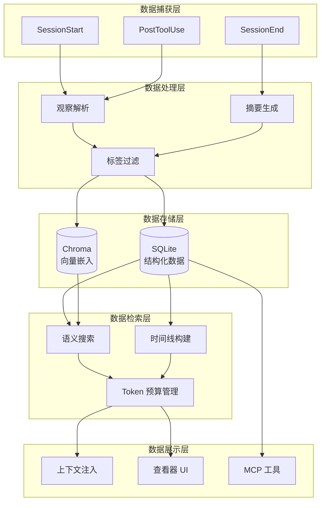
