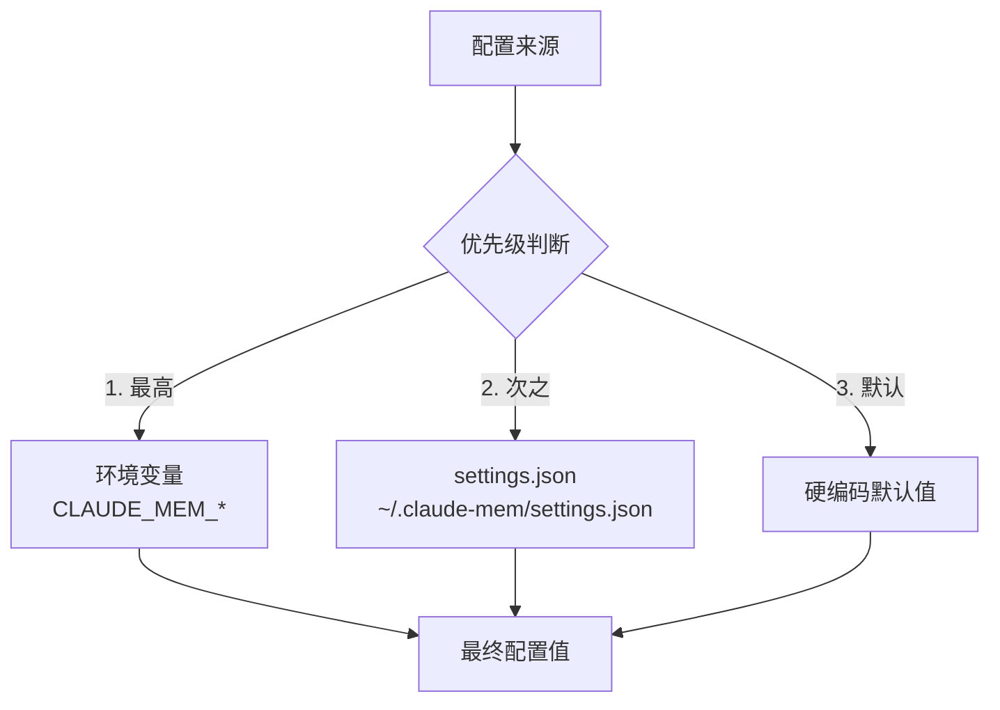
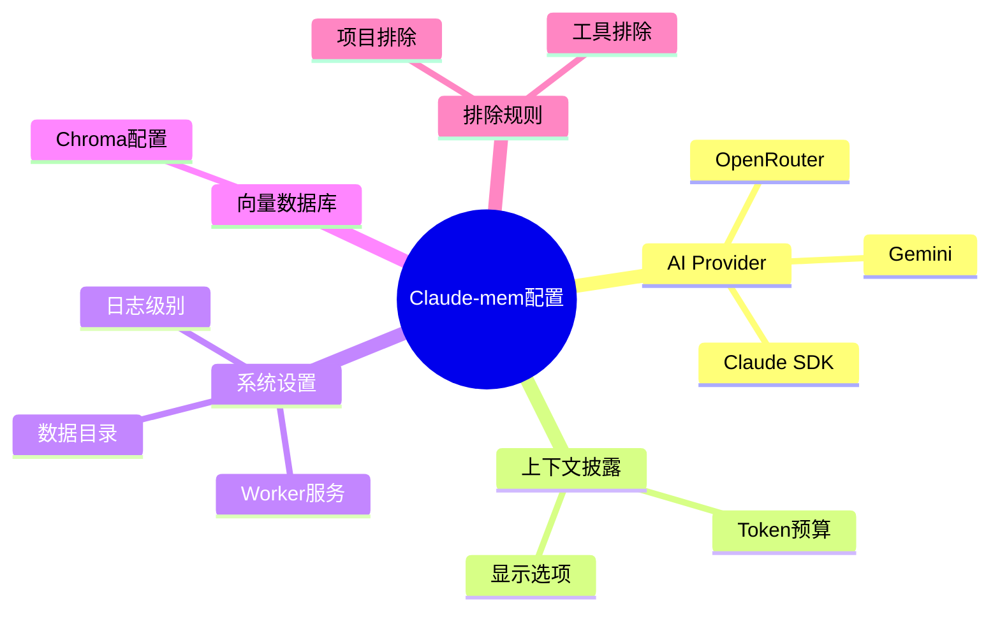
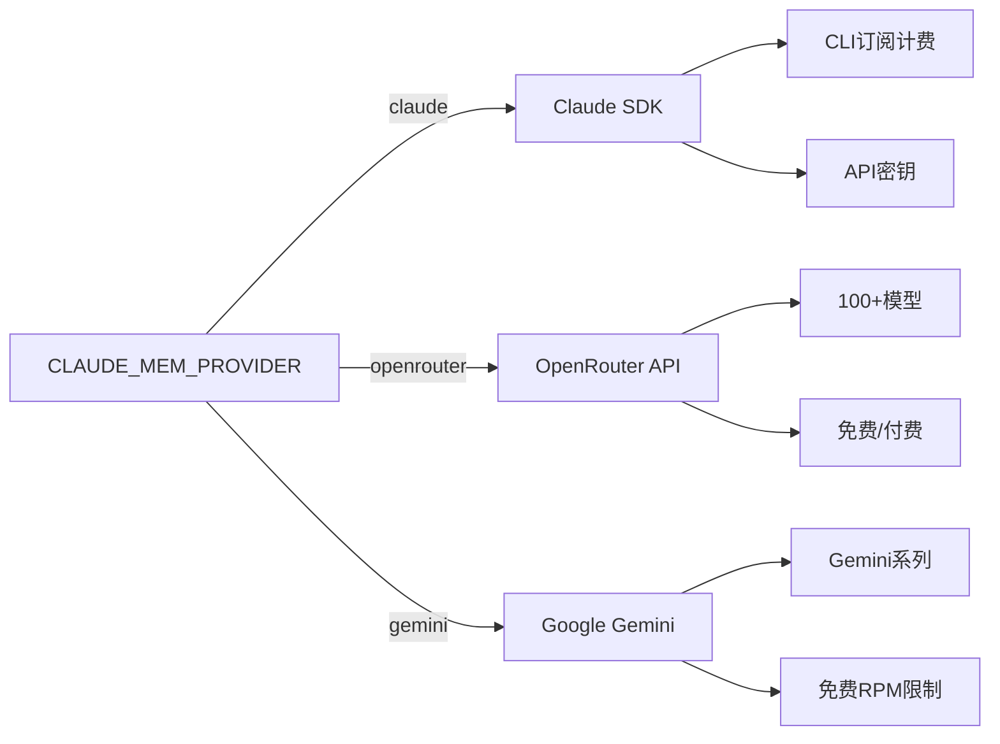
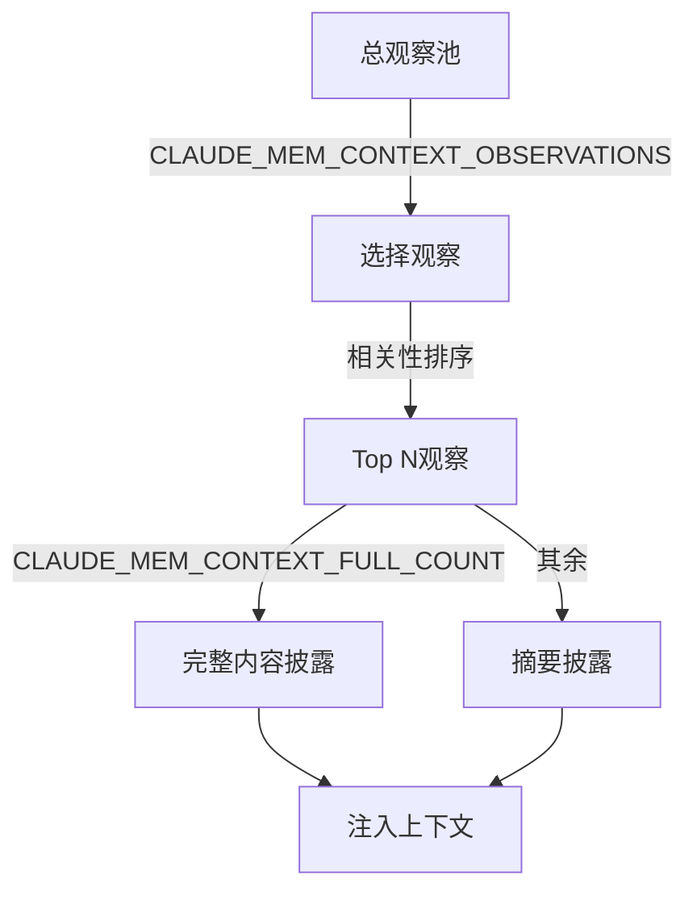
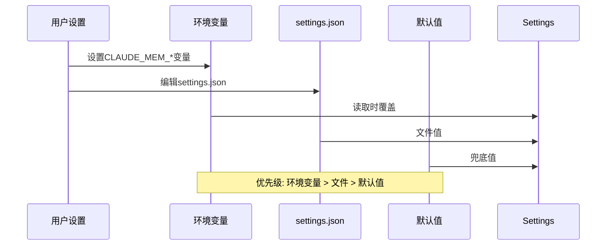
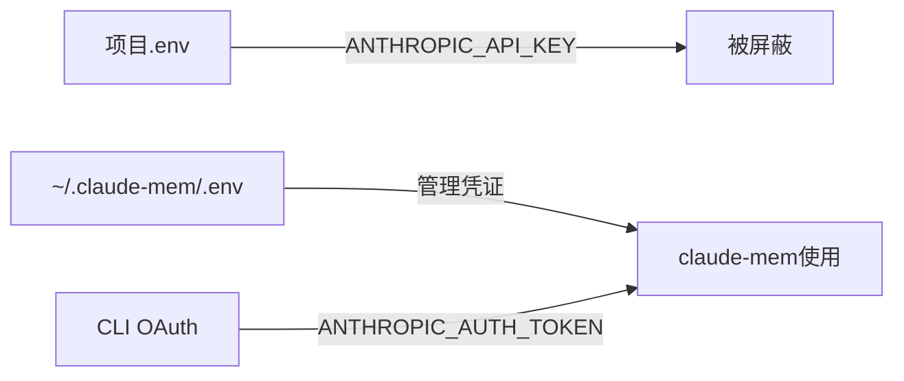

# 4、配置指南与高级设置

<details>
<summary>相关源文件</summary>

- src/shared/SettingsDefaultsManager.ts
- src/shared/EnvManager.ts
- src/services/worker/OpenRouterAgent.ts
- src/services/worker/GeminiAgent.ts
- src/services/context/ContextConfigLoader.ts
- src/ui/viewer/constants/settings.ts

</details>

## 概述

Claude-mem采用分层配置系统，支持灵活的自定义设置。配置文件存储在用户主目录下的`~/.claude-mem/settings.json`，同时支持通过环境变量进行覆盖。凭证信息(如API密钥)则存储在独立的`~/.claude-mem/.env`文件中，与项目环境隔离，避免冲突。

配置优先级如下：



这种设计允许用户通过环境变量临时覆盖配置，或通过settings.json持久化偏好设置，同时保留合理的默认行为。

## Settings.json配置结构

settings.json采用扁平结构存储所有配置项，首次运行时会自动创建并填充默认值。

### 配置文件位置

| 平台 | 路径 |
|------|------|
| macOS/Linux | `~/.claude-mem/settings.json` |
| Windows | `%USERPROFILE%\.claude-mem\settings.json` |

### 配置项分类



### 完整配置项列表

#### AI Provider配置

| 配置项 | 类型 | 默认值 | 说明 |
|--------|------|--------|------|
| `CLAUDE_MEM_PROVIDER` | string | `claude` | AI提供商: `claude` \| `openrouter` \| `gemini` |
| `CLAUDE_MEM_MODEL` | string | `claude-sonnet-4-5` | Claude模型ID |
| `CLAUDE_MEM_CLAUDE_AUTH_METHOD` | string | `cli` | 认证方式: `cli`(订阅) \| `api`(密钥) |
| `CLAUDE_MEM_MAX_CONCURRENT_AGENTS` | number | `2` | 最大并发Agent子进程数 |

#### OpenRouter配置

| 配置项 | 类型 | 默认值 | 说明 |
|--------|------|--------|------|
| `CLAUDE_MEM_OPENROUTER_API_KEY` | string | `""` | OpenRouter API密钥 |
| `CLAUDE_MEM_OPENROUTER_MODEL` | string | `xiaomi/mimo-v2-flash:free` | 模型ID |
| `CLAUDE_MEM_OPENROUTER_SITE_URL` | string | `""` | 站点URL(分析用) |
| `CLAUDE_MEM_OPENROUTER_APP_NAME` | string | `claude-mem` | 应用名称 |
| `CLAUDE_MEM_OPENROUTER_MAX_CONTEXT_MESSAGES` | number | `20` | 上下文最大消息数 |
| `CLAUDE_MEM_OPENROUTER_MAX_TOKENS` | number | `100000` | 上下文Token上限 |

#### Gemini配置

| 配置项 | 类型 | 默认值 | 说明 |
|--------|------|--------|------|
| `CLAUDE_MEM_GEMINI_API_KEY` | string | `""` | Gemini API密钥 |
| `CLAUDE_MEM_GEMINI_MODEL` | string | `gemini-2.5-flash-lite` | 模型ID |
| `CLAUDE_MEM_GEMINI_RATE_LIMITING_ENABLED` | boolean | `true` | 启用免费版RPM限制 |

#### 上下文披露配置

| 配置项 | 类型 | 默认值 | 说明 |
|--------|------|--------|------|
| `CLAUDE_MEM_CONTEXT_OBSERVATIONS` | number | `50` | 注入上下文的观察总数 |
| `CLAUDE_MEM_CONTEXT_FULL_COUNT` | number | `0` | 完整内容披露的观察数 |
| `CLAUDE_MEM_CONTEXT_FULL_FIELD` | string | `narrative` | 完整字段: `narrative` \| `facts` |
| `CLAUDE_MEM_CONTEXT_SESSION_COUNT` | number | `10` | 包含的最近会话数 |

#### Token经济显示

| 配置项 | 类型 | 默认值 | 说明 |
|--------|------|--------|------|
| `CLAUDE_MEM_CONTEXT_SHOW_READ_TOKENS` | boolean | `false` | 显示读取Token数 |
| `CLAUDE_MEM_CONTEXT_SHOW_WORK_TOKENS` | boolean | `false` | 显示工作Token数 |
| `CLAUDE_MEM_CONTEXT_SHOW_SAVINGS_AMOUNT` | boolean | `false` | 显示节省Token数 |
| `CLAUDE_MEM_CONTEXT_SHOW_SAVINGS_PERCENT` | boolean | `true` | 显示节省百分比 |

#### 系统配置

| 配置项 | 类型 | 默认值 | 说明 |
|--------|------|--------|------|
| `CLAUDE_MEM_WORKER_PORT` | number | `37777` | Worker服务端口 |
| `CLAUDE_MEM_WORKER_HOST` | string | `127.0.0.1` | Worker服务主机 |
| `CLAUDE_MEM_DATA_DIR` | string | `~/.claude-mem` | 数据存储目录 |
| `CLAUDE_MEM_LOG_LEVEL` | string | `INFO` | 日志级别: `DEBUG`\|`INFO`\|`WARN`\|`ERROR` |
| `CLAUDE_MEM_MODE` | string | `code` | 模式配置: `code`及其他自定义模式 |

#### Chroma向量数据库配置

| 配置项 | 类型 | 默认值 | 说明 |
|--------|------|--------|------|
| `CLAUDE_MEM_CHROMA_ENABLED` | boolean | `true` | 启用Chroma向量搜索 |
| `CLAUDE_MEM_CHROMA_MODE` | string | `local` | 运行模式: `local` \| `remote` |
| `CLAUDE_MEM_CHROMA_HOST` | string | `127.0.0.1` | Chroma服务器主机 |
| `CLAUDE_MEM_CHROMA_PORT` | number | `8000` | Chroma服务器端口 |
| `CLAUDE_MEM_CHROMA_SSL` | boolean | `false` | 使用SSL连接 |

#### 排除配置

| 配置项 | 类型 | 默认值 | 说明 |
|--------|------|--------|------|
| `CLAUDE_MEM_EXCLUDED_PROJECTS` | string | `""` | 排除项目路径(Glob模式,逗号分隔) |
| `CLAUDE_MEM_FOLDER_MD_EXCLUDE` | string | `[]` | 排除CLAUDE.md生成的文件夹(JSON数组) |
| `CLAUDE_MEM_SKIP_TOOLS` | string | `ListMcpResourcesTool,...` | 不记录的工具(逗号分隔) |

## AI模型配置

Claude-mem支持三种AI Provider：Claude SDK(默认)、OpenRouter和Gemini。通过`CLAUDE_MEM_PROVIDER`切换。



### Claude SDK配置

Claude SDK是默认Provider，支持两种认证方式：

#### 方式一：CLI订阅计费(默认)

使用Claude Code CLI的订阅计费，无需配置API密钥。这是最推荐的方案，因为它使用与Claude Code相同的计费方式。

```json
{
  "CLAUDE_MEM_PROVIDER": "claude",
  "CLAUDE_MEM_CLAUDE_AUTH_METHOD": "cli"
}
```

#### 方式二：API密钥

如需使用自己的Anthropic API密钥，将其添加到`~/.claude-mem/.env`：

```bash
# ~/.claude-mem/.env
ANTHROPIC_API_KEY=sk-ant-xxxxx
```

并在settings.json中设置：

```json
{
  "CLAUDE_MEM_PROVIDER": "claude",
  "CLAUDE_MEM_CLAUDE_AUTH_METHOD": "api"
}
```

#### 并发控制

通过`CLAUDE_MEM_MAX_CONCURRENT_AGENTS`限制同时运行的Agent进程数，防止资源过度消耗：

```json
{
  "CLAUDE_MEM_MAX_CONCURRENT_AGENTS": "2"
}
```

### OpenRouter配置

OpenRouter提供统一接口访问100+模型，包括免费选项。

#### 基础配置

```json
{
  "CLAUDE_MEM_PROVIDER": "openrouter",
  "CLAUDE_MEM_OPENROUTER_API_KEY": "sk-or-v1-xxxxx",
  "CLAUDE_MEM_OPENROUTER_MODEL": "xiaomi/mimo-v2-flash:free",
  "CLAUDE_MEM_OPENROUTER_APP_NAME": "claude-mem"
}
```

#### 上下文窗口管理

OpenRouter是有状态API，支持多轮对话。为防止上下文成本失控：

```json
{
  "CLAUDE_MEM_OPENROUTER_MAX_CONTEXT_MESSAGES": "20",
  "CLAUDE_MEM_OPENROUTER_MAX_TOKENS": "100000"
}
```

当超出限制时，系统会自动截断最早的对话历史，保留最近的消息。

#### 推荐模型

| 模型 | 费用 | 特点 |
|------|------|------|
| `xiaomi/mimo-v2-flash:free` | 免费 | 默认选项，速度快 |
| `google/gemini-2.5-flash:free` | 免费 | 质量较好 |
| `anthropic/claude-3.5-sonnet` | 付费 | 最佳质量 |

### Gemini配置

Google Gemini提供高性价比的免费选项，但有RPM(每分钟请求数)限制。

#### 基础配置

```json
{
  "CLAUDE_MEM_PROVIDER": "gemini",
  "CLAUDE_MEM_GEMINI_API_KEY": "your-api-key",
  "CLAUDE_MEM_GEMINI_MODEL": "gemini-2.5-flash-lite"
}
```

#### RPM速率限制

免费版Gemini有严格的RPM限制：

| 模型 | RPM限制 | 适合场景 |
|------|---------|----------|
| `gemini-2.0-flash-lite` | 30 | 高频低延迟 |
| `gemini-2.0-flash` | 15 | 平衡选择 |
| `gemini-2.5-flash-lite` | 10 | 默认推荐 |
| `gemini-2.5-flash` | 10 | 标准质量 |
| `gemini-2.5-pro` | 5 | 高质量需求 |
| `gemini-3-flash` | 10 | 最新模型 |
| `gemini-3-flash-preview` | 5 | 预览版 |

**付费用户注意**：如已启用Gemini计费(RPM 1000+)，可禁用速率限制：

```json
{
  "CLAUDE_MEM_GEMINI_RATE_LIMITING_ENABLED": "false"
}
```

## 搜索偏好设置

### 上下文披露策略

上下文披露决定Claude在对话中能看到多少历史记忆。系统采用分层披露策略：



#### 配置参数

```json
{
  "CLAUDE_MEM_CONTEXT_OBSERVATIONS": "50",
  "CLAUDE_MEM_CONTEXT_FULL_COUNT": "5",
  "CLAUDE_MEM_CONTEXT_FULL_FIELD": "narrative",
  "CLAUDE_MEM_CONTEXT_SESSION_COUNT": "10"
}
```

**参数说明**：
- **CLAUDE_MEM_CONTEXT_OBSERVATIONS**: 选择最相关的N个观察注入上下文
- **CLAUDE_MEM_CONTEXT_FULL_COUNT**: 其中N个观察显示完整内容，其余仅显示标题和标签
- **CLAUDE_MEM_CONTEXT_FULL_FIELD**: 完整内容显示`narrative`(叙述)或`facts`(事实)
- **CLAUDE_MEM_CONTEXT_SESSION_COUNT**: 优先包含最近N个会话的观察

### Token预算与经济性

系统可计算和显示上下文Token的经济性：

```json
{
  "CLAUDE_MEM_CONTEXT_SHOW_READ_TOKENS": "true",
  "CLAUDE_MEM_CONTEXT_SHOW_WORK_TOKENS": "true",
  "CLAUDE_MEM_CONTEXT_SHOW_SAVINGS_AMOUNT": "true",
  "CLAUDE_MEM_CONTEXT_SHOW_SAVINGS_PERCENT": "true"
}
```

**计算公式**：
```
节省Token = 工作Token(发现记忆所需) - 读取Token(注入上下文)
节省百分比 = (节省Token / 工作Token) × 100%
```

当节省百分比为正时，说明使用记忆比重新发现更高效。

### 会话范围控制

通过`CLAUDE_MEM_CONTEXT_SESSION_COUNT`控制记忆的时间范围：

| 设置值 | 行为 |
|--------|------|
| `0` | 仅当前会话 |
| `5` | 最近5个会话 |
| `10` | 最近10个会话(默认) |
| `-1` | 所有历史会话 |

## 环境变量

所有`CLAUDE_MEM_*`环境变量均可覆盖settings.json中的配置。

### 配置优先级详解



### 常用环境变量

| 环境变量 | 用途 | 示例 |
|----------|------|------|
| `CLAUDE_MEM_PROVIDER` | 快速切换Provider | `gemini` |
| `CLAUDE_MEM_LOG_LEVEL` | 调试日志 | `DEBUG` |
| `CLAUDE_MEM_WORKER_PORT` | 端口冲突时修改 | `37778` |
| `CLAUDE_MEM_CHROMA_ENABLED` | 禁用向量搜索 | `false` |
| `CLAUDE_MEM_CONTEXT_OBSERVATIONS` | 临时调整上下文量 | `100` |

### 临时覆盖示例

```bash
# 单次运行使用Gemini
CLAUDE_MEM_PROVIDER=gemini claude

# 调试模式运行
CLAUDE_MEM_LOG_LEVEL=DEBUG claude

# 使用不同端口(避免冲突)
CLAUDE_MEM_WORKER_PORT=37778 claude
```

## 凭证管理

API密钥存储在`~/.claude-mem/.env`，与项目环境隔离，解决Issue #733。

### Issue #733背景

Claude SDK会自动发现`ANTHROPIC_API_KEY`环境变量。如果项目目录中有`.env`文件设置了此变量，SDK会误用项目API密钥而非Claude Code CLI的订阅计费，导致意外的API费用。

### 隔离机制



### 凭证文件格式

```bash
# ~/.claude-mem/.env
# Anthropic API密钥(可选，留空使用CLI计费)
ANTHROPIC_API_KEY=sk-ant-xxxxx

# Gemini API密钥
GEMINI_API_KEY=your-gemini-key

# OpenRouter API密钥
OPENROUTER_API_KEY=sk-or-v1-xxxxx
```

### 设置凭证

可通过以下方式设置：

1. **UI设置界面**：Viewer UI提供安全的密钥输入界面
2. **手动编辑**：直接编辑`~/.claude-mem/.env`
3. **环境变量**：设置同名环境变量临时覆盖

## 配置示例

### 开发环境配置

```json
{
  "CLAUDE_MEM_PROVIDER": "claude",
  "CLAUDE_MEM_CLAUDE_AUTH_METHOD": "cli",
  "CLAUDE_MEM_LOG_LEVEL": "DEBUG",
  "CLAUDE_MEM_CONTEXT_OBSERVATIONS": "30",
  "CLAUDE_MEM_CONTEXT_SHOW_READ_TOKENS": "true",
  "CLAUDE_MEM_CONTEXT_SHOW_WORK_TOKENS": "true",
  "CLAUDE_MEM_MAX_CONCURRENT_AGENTS": "3",
  "CLAUDE_MEM_SKIP_TOOLS": "ListMcpResourcesTool,SlashCommand,Skill,TodoWrite,AskUserQuestion"
}
```

### 生产环境配置

```json
{
  "CLAUDE_MEM_PROVIDER": "openrouter",
  "CLAUDE_MEM_OPENROUTER_MODEL": "anthropic/claude-3.5-sonnet",
  "CLAUDE_MEM_LOG_LEVEL": "INFO",
  "CLAUDE_MEM_CONTEXT_OBSERVATIONS": "50",
  "CLAUDE_MEM_CONTEXT_FULL_COUNT": "5",
  "CLAUDE_MEM_CONTEXT_SHOW_SAVINGS_PERCENT": "true",
  "CLAUDE_MEM_MAX_CONCURRENT_AGENTS": "2",
  "CLAUDE_MEM_EXCLUDED_PROJECTS": "**/node_modules/**,**/.git/**,**/temp/**"
}
```

### 轻量级配置(低资源)

```json
{
  "CLAUDE_MEM_PROVIDER": "gemini",
  "CLAUDE_MEM_GEMINI_MODEL": "gemini-2.0-flash-lite",
  "CLAUDE_MEM_CHROMA_ENABLED": "false",
  "CLAUDE_MEM_CONTEXT_OBSERVATIONS": "20",
  "CLAUDE_MEM_MAX_CONCURRENT_AGENTS": "1"
}
```

## 高级配置技巧

### 1. 模式配置

通过`CLAUDE_MEM_MODE`选择观察模式，影响提示词和观察类型：

```json
{
  "CLAUDE_MEM_MODE": "code"
}
```

可用模式：
- `code`：软件开发模式(默认)
- `email-investigation`：邮件调查模式
- 自定义模式：在`plugin/modes/`目录创建JSON文件

### 2. 项目排除

排除不需要记忆的项目路径：

```json
{
  "CLAUDE_MEM_EXCLUDED_PROJECTS": "**/node_modules/**,**/vendor/**,**/.cache/**,**/temp/**"
}
```

### 3. 工具使用过滤

排除高频但无意义的工具调用：

```json
{
  "CLAUDE_MEM_SKIP_TOOLS": "ListMcpResourcesTool,SlashCommand,Skill,TodoWrite,AskUserQuestion,Glob,Read"
}
```

### 4. 仅SQLite模式

在资源受限环境禁用Chroma向量搜索：

```json
{
  "CLAUDE_MEM_CHROMA_ENABLED": "false"
}
```

**注意**：禁用后搜索仅依赖SQLite文本匹配，语义搜索功能将不可用。

### 5. 远程Chroma

连接外部Chroma服务器：

```json
{
  "CLAUDE_MEM_CHROMA_MODE": "remote",
  "CLAUDE_MEM_CHROMA_HOST": "chroma.example.com",
  "CLAUDE_MEM_CHROMA_PORT": "8000",
  "CLAUDE_MEM_CHROMA_SSL": "true"
}
```

## 故障排查

### 配置不生效

1. 检查配置优先级：环境变量会覆盖settings.json
2. 重启Worker服务：`claude-mem restart`
3. 验证配置文件路径：`~/.claude-mem/settings.json`

### API密钥错误

1. 确认密钥存储在`~/.claude-mem/.env`而非项目.env
2. 检查密钥格式是否正确(无多余空格)
3. 验证Provider切换后重启服务

### 上下文不显示

1. 检查`CLAUDE_MEM_CONTEXT_OBSERVATIONS`设置
2. 确认Chroma已启用(语义搜索依赖)
3. 查看日志确认观察是否被存储

### 速率限制

**Gemini用户**：免费版RPM严格限制，如遇429错误：
1. 等待冷却(通常1分钟)
2. 切换到低RPM模型(`gemini-2.0-flash-lite`: 30 RPM)
3. 或启用付费计费并禁用`CLAUDE_MEM_GEMINI_RATE_LIMITING_ENABLED`

---

*文档版本: 1.0 | 基于Claude-mem v10.5.5*