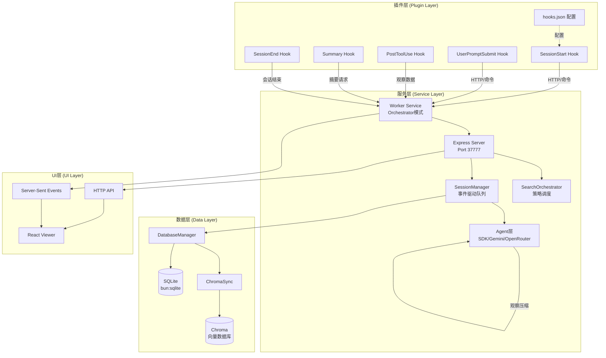
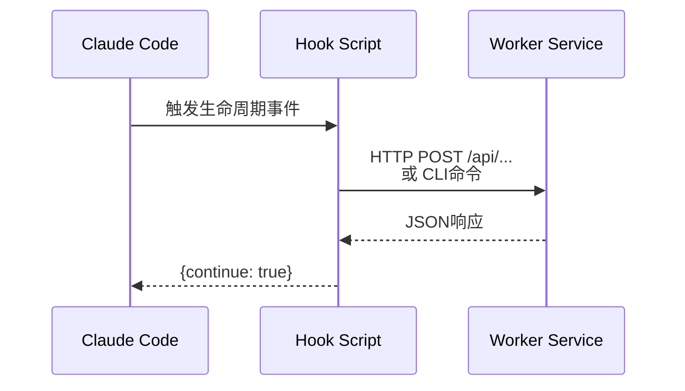
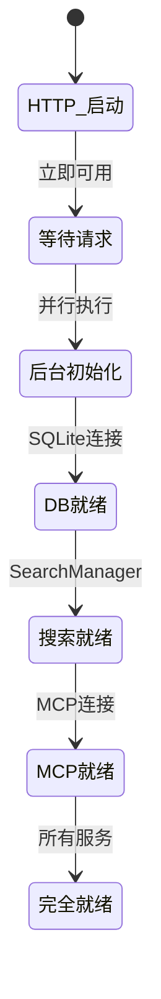
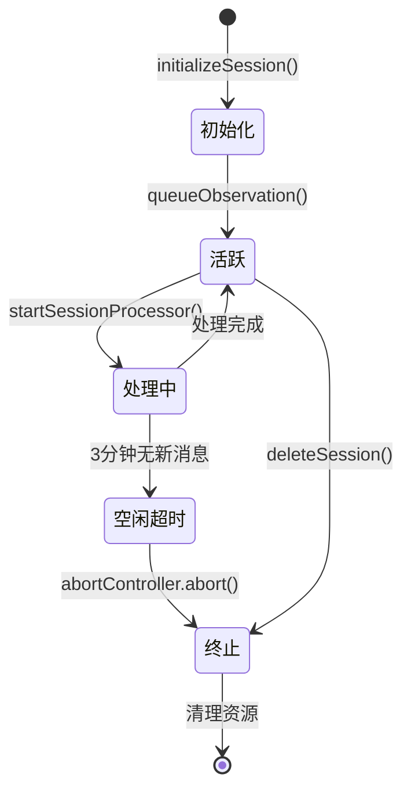
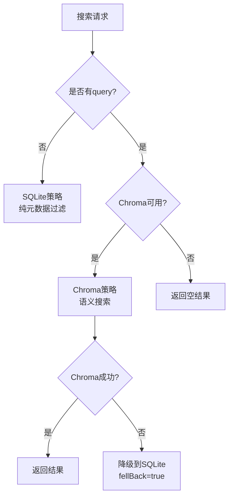
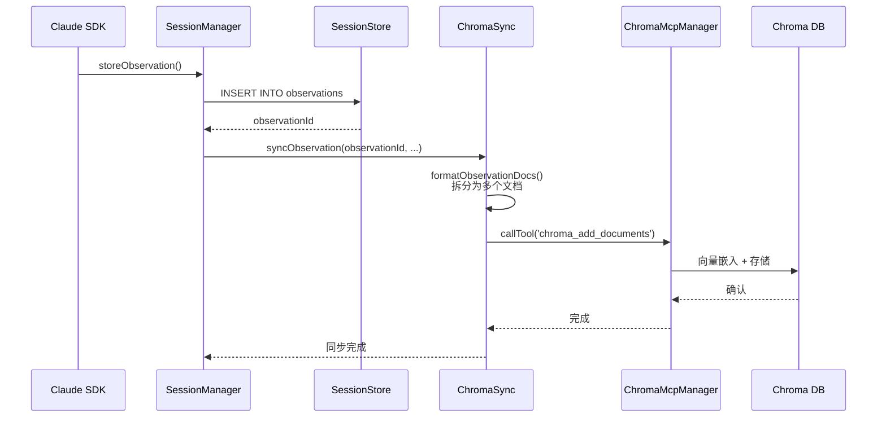
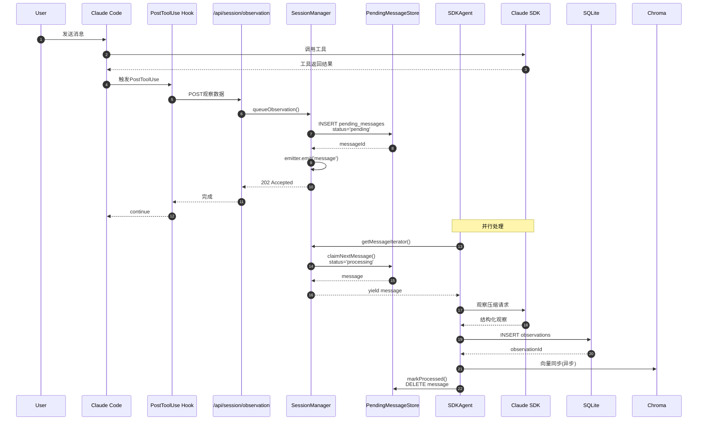
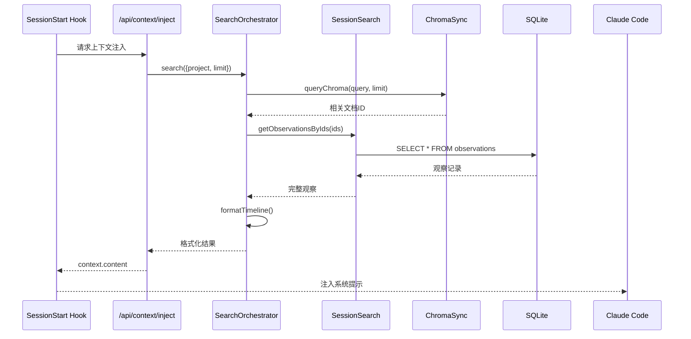
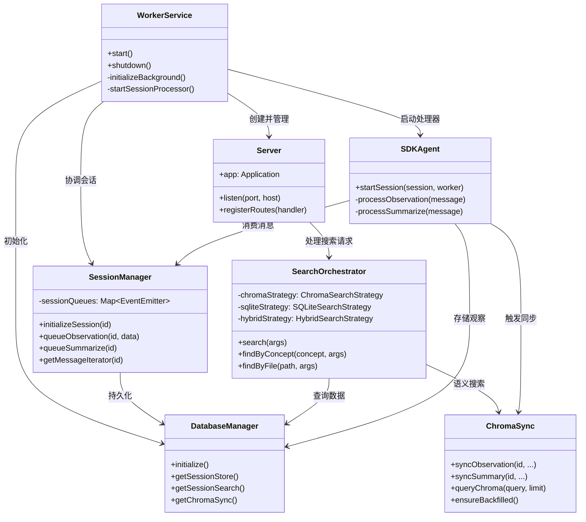

# 5、系统架构总览

<details>
<summary>相关源文件</summary>

- src/services/worker-service.ts
- src/services/server/Server.ts
- src/services/sqlite/Database.ts
- src/services/worker/SessionManager.ts
- src/services/worker/search/SearchOrchestrator.ts
- src/services/worker/search/strategies/SearchStrategy.ts
- src/services/sync/ChromaSync.ts
- src/services/worker/SDKAgent.ts
- plugin/hooks/hooks.json
- plugin/.claude-plugin/plugin.json
</details>

## 概述

Claude-mem是一个为Claude Code提供跨会话持久记忆能力的插件系统。它通过5个生命周期钩子(SessionStart、UserPromptSubmit、PostToolUse、Summary、SessionEnd)捕获AI交互中的观察数据，使用AI SDK进行智能压缩和摘要，并通过SQLite和Chroma向量数据库存储与检索历史上下文。

**核心设计目标**：
- **零延迟事件驱动**：使用EventEmitter实现消息队列的零延迟通知
- **崩溃安全**：所有关键数据先持久化到SQLite，再进入内存处理
- **分层架构**：清晰的职责分离，便于测试和扩展
- **多AI Provider支持**：Claude SDK、Gemini、OpenRouter无缝切换

## 系统架构图



## 核心目录结构

```
claude-mem/
├─ plugin/                      # 插件输出目录
│  ├─ hooks/hooks.json          # 生命周期钩子配置
│  ├─ .claude-plugin/           # Claude Code插件元数据
│  ├─ modes/                    # 运行模式配置(多语言/场景)
│  ├─ scripts/                  # 构建后的钩子脚本
│  └─ ui/                       # 构建后的查看器UI
│
├─ src/                         # 源代码目录
│  ├─ hooks/                    # 钩子TypeScript源码
│  ├─ services/                 # 核心服务层
│  │  ├─ worker-service.ts      # Worker服务入口
│  │  ├─ server/                # HTTP服务器
│  │  │  ├─ Server.ts           # Express应用
│  │  │  ├─ Middleware.ts       # 中间件
│  │  │  └─ ErrorHandler.ts     # 错误处理
│  │  ├─ worker/                # 业务逻辑
│  │  │  ├─ SessionManager.ts   # 会话管理
│  │  │  ├─ DatabaseManager.ts  # 数据库管理
│  │  │  ├─ search/             # 搜索模块
│  │  │  │  ├─ SearchOrchestrator.ts
│  │  │  │  ├─ strategies/      # 搜索策略
│  │  │  │  │  ├─ SearchStrategy.ts      # 策略接口
│  │  │  │  │  ├─ ChromaSearchStrategy.ts
│  │  │  │  │  ├─ SQLiteSearchStrategy.ts
│  │  │  │  │  └─ HybridSearchStrategy.ts
│  │  │  │  └─ filters/         # 过滤器
│  │  │  ├─ agents/             # AI代理
│  │  │  │  ├─ SDKAgent.ts      # Claude SDK代理
│  │  │  │  ├─ GeminiAgent.ts   # Gemini代理
│  │  │  │  └─ OpenRouterAgent.ts
│  │  │  └─ http/routes/        # HTTP路由
│  │  ├─ sqlite/                # SQLite数据访问层
│  │  │  ├─ Database.ts         # 数据库连接
│  │  │  ├─ SessionStore.ts     # 会话存储
│  │  │  ├─ SessionSearch.ts    # 搜索查询
│  │  │  ├─ PendingMessageStore.ts
│  │  │  └─ migrations/         # 数据库迁移
│  │  ├─ sync/                  # 向量同步
│  │  │  ├─ ChromaSync.ts       # Chroma同步服务
│  │  │  └─ ChromaMcpManager.ts # MCP管理器
│  │  └─ infrastructure/        # 基础设施
│  │     ├─ ProcessManager.ts   # 进程管理
│  │     ├─ HealthMonitor.ts    # 健康检查
│  │     └─ GracefulShutdown.ts # 优雅关闭
│  ├─ ui/viewer/                # React查看器源码
│  ├─ sdk/                      # AI SDK集成
│  └─ shared/                   # 共享工具
│
└─ docs/                        # 文档
```

## 架构概览

### 1. 插件层 (Plugin Layer)

**职责**：定义Claude Code插件的生命周期钩子，作为外部触发器

**核心组件**：
- **hooks.json** (84行配置): 定义5个生命周期钩子
  - `SessionStart`: 启动Worker服务 + 注入上下文
  - `UserPromptSubmit`: 初始化会话
  - `PostToolUse`: 捕获工具使用观察
  - `Stop`: 生成会话摘要
  - `SessionEnd`: 清理会话资源

- **触发机制**：Claude Code框架调用命令，触发Worker HTTP API或脚本执行



### 2. 服务层 (Service Layer)

#### 2.1 Worker Service (精简Orchestrator)

**设计理念**：从2000行单体重构为约300行的精简编排器

**核心职责**：
1. **服务编排**：协调Server、SessionManager、Agent等组件
2. **后台初始化**：HTTP先启动，后台再初始化DB和搜索
3. **进程管理**：PID文件、健康检查、优雅关闭

```typescript
// 核心初始化流程 (worker-service.ts:350-503)
1. start() -> 启动HTTP服务器
2. initializeBackground() -> 后台初始化
   - 初始化SQLite
   - 初始化ChromaMcpManager
   - 初始化SearchManager
   - 连接MCP服务器
   - 启动僵尸进程清理
```

**双阶段初始化模式**：
- **阶段1（同步）**：启动HTTP服务器，返回ready状态
- **阶段2（异步）**：后台初始化数据库、搜索、MCP连接



#### 2.2 SessionManager (事件驱动架构)

**核心设计**：使用Node.js EventEmitter实现零延迟消息队列

**关键特性**：
1. **崩溃安全**：消息先写入SQLite的`pending_messages`表，再通知消费者
2. **零延迟**：EventEmitter通知替代轮询
3. **自动恢复**：Worker重启后从数据库恢复待处理消息

```typescript
// 消息队列流程 (SessionManager.ts:201-236)
queueObservation():
  1. 持久化到pending_messages表 (Crash-safe)
  2. emitter.emit('message') (Zero-latency notify)
  3. SDKAgent通过createIterator()消费

// 迭代器模式 (SessionManager.ts:444-483)
async *getMessageIterator(sessionDbId):
  while (true):
    - 从PendingMessageStore读取
    - 标记为processing
    - yield message
    - 完成后标记为processed
```

**会话生命周期状态机**：



#### 2.3 SearchOrchestrator (策略调度)

**设计模式**：策略模式(Strategy Pattern)

**搜索策略决策树**：



**三种策略实现**：

| 策略 | 适用场景 | 实现文件 |
|------|----------|----------|
| **SQLite** | 纯过滤条件（无query）、Chroma不可用时 | `SQLiteSearchStrategy.ts` |
| **Chroma** | 语义搜索（有query文本） | `ChromaSearchStrategy.ts` |
| **Hybrid** | 元数据过滤+语义排序 | `HybridSearchStrategy.ts` |

**Hybrid策略四步算法**：

```typescript
// HybridSearchStrategy.ts:64-124
1. SQLite元数据过滤: WHERE concepts LIKE '%concept%'
2. Chroma语义排序: queryChroma(concept, limit)
3. 交集排序: 保留SQLite结果，按Chroma排名重排
4. 水合: 从SQLite获取完整数据
```

### 3. 数据层 (Data Layer)

#### 3.1 SQLite (bun:sqlite)

**优化配置** (`Database.ts:162-168`)：

```sql
PRAGMA journal_mode = WAL        -- 写前日志，提升并发
PRAGMA synchronous = NORMAL      -- 平衡性能与安全
PRAGMA foreign_keys = ON         -- 外键约束
PRAGMA temp_store = memory       -- 临时表内存存储
PRAGMA mmap_size = 256MB         -- 内存映射
PRAGMA cache_size = 10000        -- 页面缓存
```

**核心表结构**：

| 表名 | 用途 | 关键字段 |
|------|------|----------|
| `sessions` | 会话管理 | content_session_id, memory_session_id, project |
| `observations` | 观察数据 | type, title, facts(narrative), concepts(JSON) |
| `session_summaries` | 会话摘要 | request, learned, completed, next_steps |
| `user_prompts` | 用户输入 | prompt_text, prompt_number |
| `pending_messages` | 消息队列 | status(pending/processing/processed) |

#### 3.2 Chroma (向量数据库)

**同步架构** (`ChromaSync.ts`)：



**文档拆分策略**：每个观察拆分为多个向量文档
- `obs_{id}_narrative` - 叙述文本
- `obs_{id}_fact_{n}` - 每个事实独立文档
- `obs_{id}_text` - 原始文本（遗留）

**智能回填机制**：

```typescript
// ChromaSync.ts:517-681 ensureBackfilled()
1. 获取Chroma已有文档ID集合
2. 查询SQLite中缺失的observations/summaries/prompts
3. 批量格式化并同步（BATCH_SIZE=100）
4. 按项目逐步回填，失败项目跳过继续
```

### 4. UI层 (UI Layer)

**架构**：React SPA + Server-Sent Events实时更新

**组件架构**：

```
Viewer UI (localhost:37777)
├─ SearchPanel          # 搜索界面
│  ├─ QueryInput        # 查询输入
│  ├─ FilterBar         # 过滤器(概念/文件/类型)
│  └─ ResultsList       # 结果列表
├─ TimelineView         # 时间线视图
│  ├─ DateGroup         # 日期分组
│  └─ ObservationCard   # 观察卡片
├─ SessionList          # 会话列表
└─ StatusBar            # 状态栏(SSE实时)
```

**实时通信**：
- **SSE端点**: `/api/sse`
- **推送事件**: `processing_status`、`session_update`、`observation_added`
- **实现**: `SSEBroadcaster.ts`管理客户端连接

## 数据流分析

### 观察捕获完整流程



**关键设计点**：
1. **步骤8**: 消息先落库，确保崩溃后可恢复
2. **步骤14**: 使用迭代器模式，消费者按需拉取
3. **步骤19-20**: 观察存储和向量同步分离，降低延迟
4. **并发控制**: SessionManager跟踪processing状态，避免重复处理

### 上下文披露流程



## 设计模式应用

### 1. 策略模式 (Strategy Pattern)

**应用场景**：搜索算法选择

```typescript
// SearchStrategy.ts - 策略接口
interface SearchStrategy {
  search(options: StrategySearchOptions): Promise<StrategySearchResult>;
  canHandle(options: StrategySearchOptions): boolean;
}

// 具体策略实现
class ChromaSearchStrategy implements SearchStrategy {
  search() { /* 向量语义搜索 */ }
}

class SQLiteSearchStrategy implements SearchStrategy {
  search() { /* SQL元数据过滤 */ }
}

class HybridSearchStrategy implements SearchStrategy {
  search() { /* 混合搜索 */ }
}

// 策略调度
class SearchOrchestrator {
  async executeWithFallback(options) {
    if (!options.query) return sqliteStrategy.search(options);
    if (chromaStrategy.canHandle(options)) {
      const result = await chromaStrategy.search(options);
      if (!result.usedChroma) return sqliteStrategy.search(options);
      return result;
    }
  }
}
```

**优势**：
- 算法可替换，不影响调用方
- 易于单元测试（可Mock策略）
- 符合开闭原则：新策略只需实现接口

### 2. 观察者模式 (Observer Pattern)

**应用场景**：Session消息队列

```typescript
// SessionManager.ts - EventEmitter作为Subject
class SessionManager {
  private sessionQueues: Map<number, EventEmitter> = new Map();

  queueObservation(sessionDbId, data) {
    // 1. 持久化到数据库
    const messageId = pendingStore.enqueue(...);
    // 2. 通知观察者
    const emitter = this.sessionQueues.get(sessionDbId);
    emitter?.emit('message');  // 触发观察者的回调
  }

  // Observer通过迭代器订阅
  async *getMessageIterator(sessionDbId) {
    const emitter = this.sessionQueues.get(sessionDbId);
    while (true) {
      // 等待Subject的通知
      await once(emitter, 'message');
      // 拉取并yield消息
      const message = pendingStore.claimNextMessage();
      if (message) yield message;
    }
  }
}
```

**优势**：
- 零延迟通知，替代轮询
- 解耦生产者和消费者
- 支持多个消费者（虽然当前是1:1）

### 3. 插件模式 (Plugin Pattern)

**应用场景**：Claude Code钩子系统

```json
// hooks.json - 声明式配置
{
  "hooks": {
    "PostToolUse": [{
      "matcher": "*",
      "hooks": [{
        "type": "command",
        "command": "...worker-service.cjs hook claude-code observation",
        "timeout": 120
      }]
    }]
  }
}
```

**设计要点**：
- **声明式配置**：钩子行为通过JSON配置，无需修改代码
- **匹配器模式**：`matcher`字段支持通配符匹配
- **超时控制**：每个钩子可独立配置超时

## 扩展点设计

### 1. 添加新钩子

**步骤**：
1. 在`hooks.json`添加钩子配置
2. 在`worker-service.ts`的`main()`函数添加命令处理
3. 实现对应的处理函数

**示例**：添加`PreToolUse`钩子

```json
// hooks.json
{
  "PreToolUse": [{
    "matcher": "*",
    "hooks": [{
      "type": "command",
      "command": "...worker-service.cjs hook claude-code pre-tool",
      "timeout": 30
    }]
  }]
}
```

```typescript
// worker-service.ts main()函数
case 'hook': {
  // ...
  if (event === 'pre-tool') {
    await handlePreToolHook(platform);
  }
}
```

### 2. 添加新搜索策略

**步骤**：
1. 实现`SearchStrategy`接口
2. 在`SearchOrchestrator`中注册

**示例**：添加`FullTextSearchStrategy`

```typescript
// strategies/FullTextSearchStrategy.ts
export class FullTextSearchStrategy extends BaseSearchStrategy {
  readonly name = 'fulltext';

  canHandle(options: StrategySearchOptions): boolean {
    return !!options.query && options.strategyHint === 'fulltext';
  }

  async search(options: StrategySearchOptions): Promise<StrategySearchResult> {
    // 使用SQLite FTS5全文搜索
    const results = this.db.prepare(`
      SELECT * FROM observations 
      WHERE narrative MATCH ?
    `).all(options.query);
    return { results, usedChroma: false, strategy: 'fulltext' };
  }
}

// SearchOrchestrator.ts 注册
constructor() {
  this.fulltextStrategy = new FullTextSearchStrategy(sessionSearch);
}
```

### 3. 添加新AI Provider

**步骤**：
1. 创建Agent类（参考`SDKAgent.ts`结构）
2. 实现`startSession()`方法
3. 在`WorkerService`中初始化和选择

**参考实现模式**：

```typescript
// agents/NewProviderAgent.ts
export class NewProviderAgent {
  async startSession(session, workerService) {
    // 1. 初始化Provider客户端
    const client = new NewProviderClient({...});
    
    // 2. 创建消息迭代器
    const iterator = sessionManager.getMessageIterator(session.sessionDbId);
    
    // 3. 消费消息循环
    for await (const message of iterator) {
      if (message.type === 'observation') {
        // 4. 调用AI进行压缩
        const observation = await client.compress(message);
        // 5. 存储结果
        await this.storeObservation(observation);
      }
    }
  }
}
```

### 4. 添加新运行模式

**Mode系统** (`ModeManager.ts`)支持通过JSON配置切换行为：

```json
// modes/custom-mode.json
{
  "id": "custom",
  "name": "Custom Mode",
  "description": "自定义模式",
  "contextInjection": {
    "enabled": true,
    "maxTokens": 8000
  },
  "agent": {
    "provider": "openrouter",
    "model": "anthropic/claude-3-5-sonnet"
  }
}
```

## 组件关系图



## 总结

Claude-mem采用清晰的分层架构，各层职责明确：

1. **插件层**通过声明式配置定义生命周期钩子
2. **服务层**使用Orchestrator模式协调各组件，事件驱动实现零延迟
3. **数据层**采用SQLite+Chroma双存储，兼顾可靠性和语义搜索能力
4. **UI层**提供React界面和SSE实时更新

**核心架构优势**：
- **可扩展性**：策略模式支持新搜索算法，插件模式支持新钩子
- **可靠性**：崩溃安全的消息队列和优雅关闭机制
- **性能**：后台初始化、批量同步、内存映射等优化手段
- **多租户**：项目隔离、模式配置支持不同使用场景
