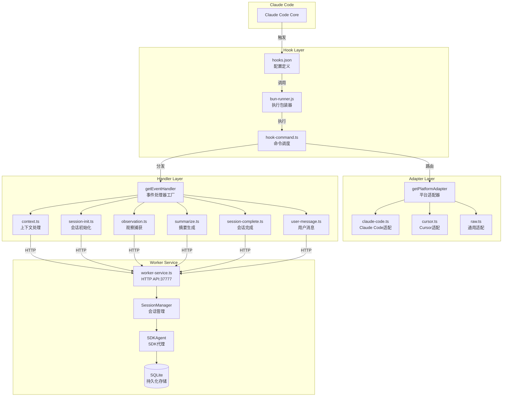
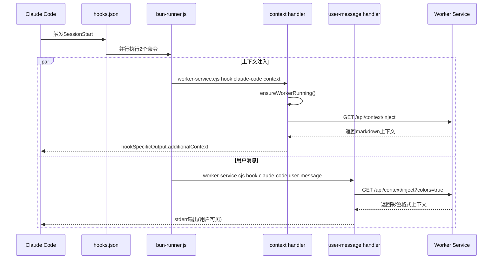
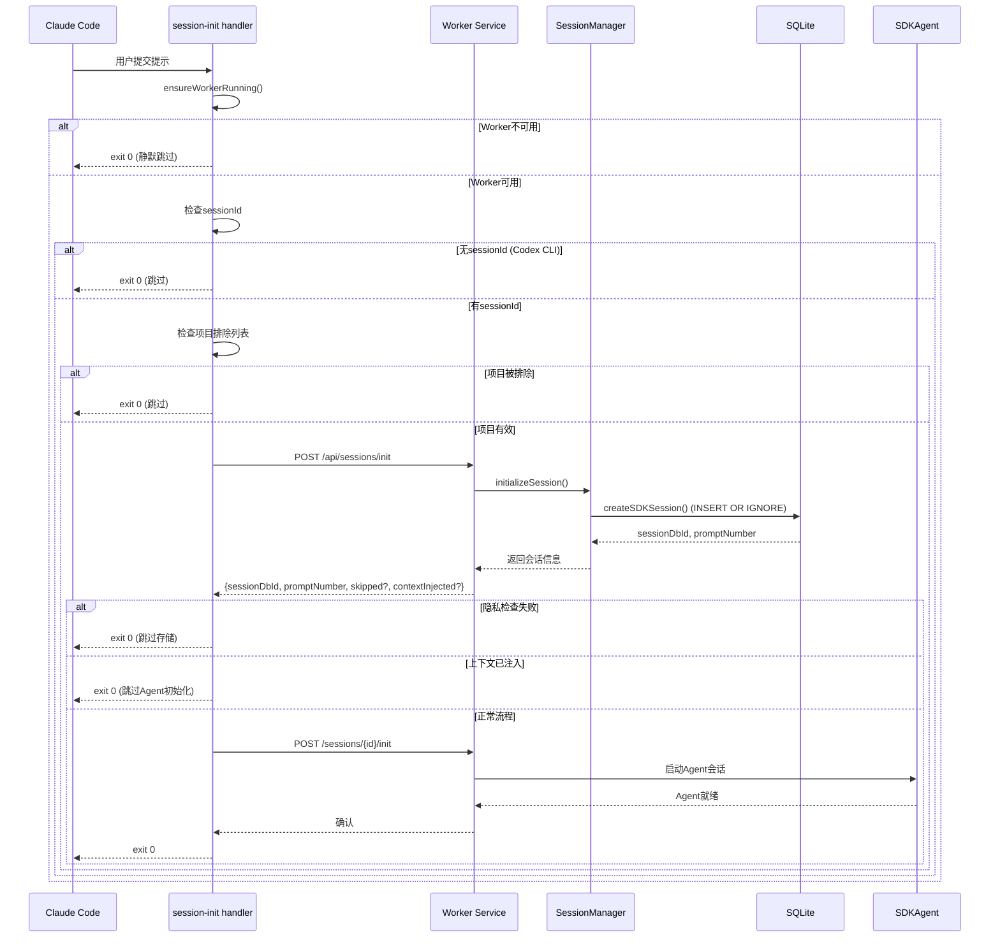
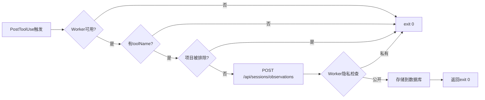
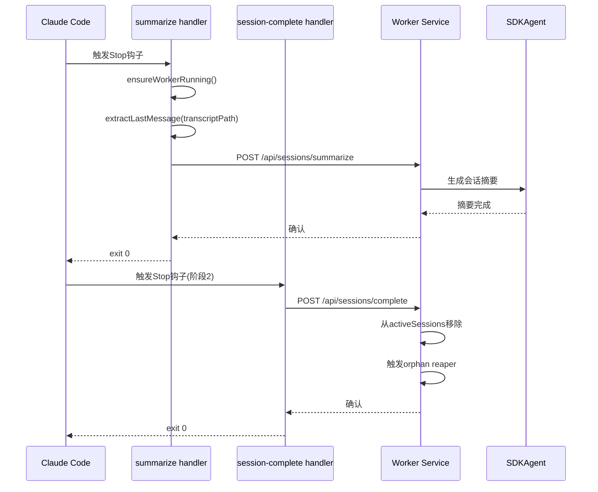
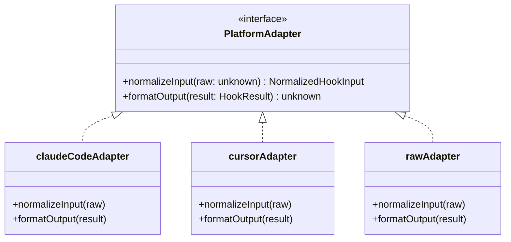

# 6、生命周期钩子系统

<details>
<summary>相关源文件</summary>

- plugin/hooks/hooks.json
- src/cli/hook-command.ts
- src/cli/types.ts
- src/cli/handlers/index.ts
- src/cli/handlers/context.ts
- src/cli/handlers/session-init.ts
- src/cli/handlers/observation.ts
- src/cli/handlers/summarize.ts
- src/cli/handlers/session-complete.ts
- src/cli/handlers/user-message.ts
- src/cli/adapters/claude-code.ts
- src/cli/adapters/cursor.ts
- src/shared/hook-constants.ts
- src/hooks/hook-response.ts
- src/services/worker/agents/SessionCleanupHelper.ts
- src/services/sqlite/sessions/create.ts
- src/services/worker/SessionManager.ts

</details>

## 概述

Claude-mem的生命周期钩子系统是一个基于Claude Code Hook API的插件架构，通过5个核心钩子实现跨会话的持久记忆功能。系统在Claude Code会话的各个关键节点捕获数据，通过HTTP协议与Worker服务通信，完成观察存储、上下文注入和摘要生成等功能。

**核心设计理念**：
- **非侵入式设计**：钩子以独立进程运行，不阻塞主流程
- **优雅降级**：Worker服务不可用时，钩子静默失败不影响用户体验
- **边缘处理**：隐私标签过滤在钩子层完成，敏感数据不会进入数据库
- **事件驱动**：通过事件队列实现零延迟的消息处理

## 钩子系统整体架构

### 5个生命周期钩子

| 钩子名称 | 触发时机 | 事件处理器 | 主要职责 |
|---------|---------|-----------|---------|
| **SessionStart** | 会话开始（启动/清除/压缩） | context, user-message | 注入历史上下文、显示状态信息 |
| **UserPromptSubmit** | 用户提交提示 | session-init | 初始化会话、启动SDK Agent |
| **PostToolUse** | 工具使用后 | observation | 捕获工具调用和响应 |
| **Stop** | 用户停止/总结时 | summarize, session-complete | 生成摘要、完成会话 |
| **SessionEnd** | 会话结束时 | session-complete | 清理会话状态 |

### 架构分层



### 核心目录结构

```
src/
├── cli/
│   ├── hook-command.ts          # 钩子命令入口
│   ├── types.ts                 # 钩子类型定义
│   ├── stdin-reader.ts          # 标准输入读取
│   ├── adapters/
│   │   ├── index.ts             # 适配器工厂
│   │   ├── claude-code.ts       # Claude Code格式适配
│   │   ├── cursor.ts            # Cursor IDE适配
│   │   └── raw.ts               # 原始格式适配
│   └── handlers/
│       ├── index.ts             # 处理器工厂
│       ├── context.ts           # SessionStart处理
│       ├── session-init.ts      # UserPromptSubmit处理
│       ├── observation.ts       # PostToolUse处理
│       ├── summarize.ts         # Stop处理(阶段1)
│       ├── session-complete.ts  # Stop/SessionEnd处理
│       ├── user-message.ts      # SessionStart并行处理
│       └── file-edit.ts         # Cursor文件编辑处理
├── hooks/
│   └── hook-response.ts         # 标准响应格式
├── shared/
│   ├── hook-constants.ts        # 钩子时序和退出码
│   └── worker-utils.ts          # Worker通信工具
└── services/
    └── worker/
        ├── SessionManager.ts    # 会话状态管理
        └── agents/
            └── SessionCleanupHelper.ts  # 会话清理
```

## SessionStart钩子

### 触发时机

SessionStart钩子在以下场景触发：
- **startup**: Claude Code启动时
- **clear**: 用户执行清除操作时
- **compact**: 上下文压缩时

### 执行流程



### 关键实现

**context.ts** 处理上下文注入：

```typescript
export const contextHandler: EventHandler = {
  async execute(input: NormalizedHookInput): Promise<HookResult> {
    // 1. 确保Worker运行
    const workerReady = await ensureWorkerRunning();
    if (!workerReady) {
      return {
        hookSpecificOutput: {
          hookEventName: 'SessionStart',
          additionalContext: ''  // Worker不可用，返回空上下文
        },
        exitCode: HOOK_EXIT_CODES.SUCCESS
      };
    }
    
    // 2. 获取项目上下文
    const context = getProjectContext(cwd);
    
    // 3. 请求上下文注入
    const response = await fetch(
      `http://127.0.0.1:${port}/api/context/inject?projects=${projectsParam}`
    );
    
    const additionalContext = await response.text();
    
    // 4. 返回Claude Code特定格式
    return {
      hookSpecificOutput: {
        hookEventName: 'SessionStart',
        additionalContext
      }
    };
  }
};
```

**设计特点**：
- 使用 `hookSpecificOutput` 向Claude Code注入上下文
- 同时请求彩色版本供终端显示（可选）
- Worker不可用时返回空字符串，不阻塞会话启动

## UserPromptSubmit钩子

### 触发时机

每次用户提交提示时触发，是钩子系统中调用最频繁的钩子。

### 执行流程



### 会话创建幂等性

**createSDKSession** 实现幂等创建：

```typescript
export function createSDKSession(
  db: Database,
  contentSessionId: string,
  project: string,
  userPrompt: string
): number {
  // 1. 检查现有会话
  const existing = db.prepare(`
    SELECT id FROM sdk_sessions WHERE content_session_id = ?
  `).get(contentSessionId) as { id: number } | undefined;
  
  if (existing) {
    // 2. 回填可能缺失的字段
    if (project) {
      db.prepare(`
        UPDATE sdk_sessions SET project = ?
        WHERE content_session_id = ? AND (project IS NULL OR project = '')
      `).run(project, contentSessionId);
    }
    return existing.id;  // 返回已有ID
  }
  
  // 3. 创建新会话
  db.prepare(`
    INSERT INTO sdk_sessions
    (content_session_id, memory_session_id, project, user_prompt, 
     custom_title, started_at, started_at_epoch, status)
    VALUES (?, NULL, ?, ?, ?, ?, ?, 'active')
  `).run(contentSessionId, project, userPrompt, ...);
  
  // 返回新ID
  const row = db.prepare('SELECT id FROM sdk_sessions WHERE content_session_id = ?')
    .get(contentSessionId) as { id: number };
  return row.id;
}
```

**关键设计**：
- **INSERT OR IGNORE 模式**：确保同一content_session_id只创建一次数据库记录
- **字段回填机制**：后续提示可更新首次创建时缺失的project/custom_title
- **NULL初始化memory_session_id**：防止将会话ID错误注入用户对话

### 隐私标签过滤

Worker在 `/api/sessions/init` 端点执行隐私检查：

```typescript
// 如果提示完全被<private>标签包裹，则跳过存储
if (initResult.skipped && initResult.reason === 'private') {
  logger.info('HOOK', `INIT_COMPLETE | skipped=true | reason=private`);
  return { continue: true, suppressOutput: true };
}
```

## PostToolUse钩子

### 触发时机

每次Claude Code使用工具后触发，捕获工具名称、输入参数和响应结果。

### 执行流程



### 观察数据处理

**observation.ts** 处理工具使用捕获：

```typescript
export const observationHandler: EventHandler = {
  async execute(input: NormalizedHookInput): Promise<HookResult> {
    const { sessionId, cwd, toolName, toolInput, toolResponse } = input;
    
    // 工具名称标准化
    const toolStr = logger.formatTool(toolName, toolInput);
    
    // 发送到Worker处理
    const response = await fetch(`http://127.0.0.1:${port}/api/sessions/observations`, {
      method: 'POST',
      headers: { 'Content-Type': 'application/json' },
      body: JSON.stringify({
        contentSessionId: sessionId,
        tool_name: toolName,
        tool_input: toolInput,
        tool_response: toolResponse,
        cwd
      })
    });
    
    // Worker负责隐私检查和数据库存储
    return { continue: true, suppressOutput: true };
  }
};
```

### 观察类型识别

Worker根据工具名称和输入自动识别观察类型：
- **Decision**: 涉及架构决策的工具调用
- **Change**: 代码修改相关操作
- **Discovery**: 代码探索和理解
- **Pattern**: 识别代码模式
- **Trade-off**: 技术权衡分析
- **Generic**: 其他类型

## Summary钩子

### 触发时机

当用户停止会话或请求总结时触发（Stop钩子）。

### 两阶段处理



### 摘要生成流程

**summarize.ts** 提取最后消息并请求摘要：

```typescript
export const summarizeHandler: EventHandler = {
  async execute(input: NormalizedHookInput): Promise<HookResult> {
    const { sessionId, transcriptPath } = input;
    
    // 1. 从对话记录提取最后一条助手消息
    const lastAssistantMessage = extractLastMessage(
      transcriptPath, 
      'assistant', 
      true  // 包含工具结果
    );
    
    // 2. 发送摘要请求（带超时）
    const response = await fetchWithTimeout(
      `http://127.0.0.1:${port}/api/sessions/summarize`,
      {
        method: 'POST',
        headers: { 'Content-Type': 'application/json' },
        body: JSON.stringify({
          contentSessionId: sessionId,
          last_assistant_message: lastAssistantMessage
        })
      },
      SUMMARIZE_TIMEOUT_MS  // 5分钟超时
    );
    
    return { continue: true, suppressOutput: true };
  }
};
```

### 转录解析器

从Claude Code的JSONL格式转录文件中提取消息：

```typescript
// src/shared/transcript-parser.ts
export function extractLastMessage(
  transcriptPath: string,
  role: 'user' | 'assistant',
  includeToolResults: boolean
): string | null {
  // 反向扫描JSONL文件，查找指定角色的消息
  // 处理工具结果嵌入（tool_use/tool_result）
}
```

## SessionEnd钩子

### 触发时机

Claude Code会话完全结束时触发，用于最终清理。

### SessionCleanupHelper

**SessionCleanupHelper.ts** 负责会话状态清理：

```typescript
export function cleanupProcessedMessages(
  session: ActiveSession,
  worker: WorkerRef | undefined
): void {
  // 1. 重置最早待处理时间戳
  session.earliestPendingTimestamp = null;
  
  // 2. 广播处理状态更新到SSE客户端
  if (worker && typeof worker.broadcastProcessingStatus === 'function') {
    worker.broadcastProcessingStatus();
  }
}
```

**设计说明**：
- 采用 **claim-and-delete** 队列模式，消息在被认领时即删除
- 无需跟踪 `pendingProcessingIds` 或清理已处理消息
- 仅重置时间戳并广播状态更新

### 会话完成处理

**session-complete.ts** 处理会话结束：

```typescript
export const sessionCompleteHandler: EventHandler = {
  async execute(input: NormalizedHookInput): Promise<HookResult> {
    const { sessionId } = input;
    
    // 1. 从activeSessions Map中移除
    const response = await fetch(`http://127.0.0.1:${port}/api/sessions/complete`, {
      method: 'POST',
      headers: { 'Content-Type': 'application/json' },
      body: JSON.stringify({ contentSessionId: sessionId })
    });
    
    // 2. 触发orphan reaper清理子进程
    // 3. 更新数据库状态为completed
    
    return { continue: true, suppressOutput: true };
  }
};
```

**解决问题**：
- **Issue #842**: 修复会话永远留在activeSessions导致orphan reaper无法回收的问题
- 通过两阶段处理（summarize → complete）确保摘要生成完成后再清理

## 钩子通信协议

### HTTP请求格式

钩子通过HTTP与Worker服务通信，统一端口为 **37777**。

**会话初始化**：
```http
POST /api/sessions/init
Content-Type: application/json

{
  "contentSessionId": "sess_abc123",
  "project": "my-project",
  "prompt": "用户输入的提示内容"
}
```

**观察存储**：
```http
POST /api/sessions/observations
Content-Type: application/json

{
  "contentSessionId": "sess_abc123",
  "tool_name": "Bash",
  "tool_input": {"command": "ls -la"},
  "tool_response": {...},
  "cwd": "/home/user/project"
}
```

**上下文注入**：
```http
GET /api/context/inject?projects=my-project,other-project&colors=true
```

### 数据格式

**NormalizedHookInput** - 统一输入格式：

```typescript
export interface NormalizedHookInput {
  sessionId: string;        // Claude Code会话ID
  cwd: string;              // 当前工作目录
  platform?: string;        // 'claude-code' | 'cursor'
  prompt?: string;          // 用户提示内容
  toolName?: string;        // 工具名称
  toolInput?: unknown;      // 工具输入参数
  toolResponse?: unknown;   // 工具响应结果
  transcriptPath?: string;  // 对话记录路径
  filePath?: string;        // Cursor: 编辑文件路径
  edits?: unknown[];        // Cursor: 编辑内容
}
```

**HookResult** - 统一输出格式：

```typescript
export interface HookResult {
  continue?: boolean;       // 是否继续处理
  suppressOutput?: boolean; // 是否抑制输出
  hookSpecificOutput?: {    // Claude Code特定输出
    hookEventName: string;
    additionalContext: string;
  };
  systemMessage?: string;   // 系统消息(显示给用户)
  exitCode?: number;        // 进程退出码
}
```

### 平台适配器



**Claude Code适配器** 处理蛇形命名法：

```typescript
export const claudeCodeAdapter: PlatformAdapter = {
  normalizeInput(raw) {
    const r = (raw ?? {}) as any;
    return {
      sessionId: r.session_id ?? r.id ?? r.sessionId,
      cwd: r.cwd ?? process.cwd(),
      prompt: r.prompt,
      toolName: r.tool_name,
      toolInput: r.tool_input,
      toolResponse: r.tool_response,
      transcriptPath: r.transcript_path,
    };
  },
  formatOutput(result) {
    // 仅输出Claude Hook合约中的字段
    if (result.hookSpecificOutput) {
      return { hookSpecificOutput: result.hookSpecificOutput };
    }
    return {};
  }
};
```

### 错误处理

**退出码策略**（基于Claude Code Hook合约）：

| 退出码 | 含义 | 行为 |
|-------|-----|------|
| **0** | 成功 | stdout添加到上下文（SessionStart/UserPromptSubmit） |
| **1** | 非阻塞错误 | stderr在verbose模式显示，不阻塞用户 |
| **2** | 阻塞错误 | stderr仅显示给用户，不注入上下文 |
| **3** | 仅用户消息 | stderr仅显示给用户（Cursor user-message处理） |

**错误分类**（hook-command.ts）：

```typescript
export function isWorkerUnavailableError(error: unknown): boolean {
  const message = error instanceof Error ? error.message : String(error);
  const lower = message.toLowerCase();
  
  // 传输层失败 - Worker不可达
  const transportPatterns = [
    'econnrefused', 'econnreset', 'epipe', 'etimedout',
    'fetch failed', 'unable to connect', 'socket hang up'
  ];
  if (transportPatterns.some(p => lower.includes(p))) return true;
  
  // 超时错误
  if (lower.includes('timed out') || lower.includes('timeout')) return true;
  
  // HTTP 5xx服务器错误
  if (/failed:\s*5\d{2}/.test(message)) return true;
  
  // HTTP 4xx客户端错误 - 我们的bug，不是Worker问题
  if (/failed:\s*4\d{2}/.test(message)) return false;
  
  return false;  // 默认：未知错误视为阻塞错误
}
```

**优雅降级逻辑**：

```typescript
try {
  const result = await handler.execute(input);
  console.log(JSON.stringify(output));
  process.exit(exitCode);
} catch (error) {
  if (isWorkerUnavailableError(error)) {
    // Worker不可用 - 优雅降级，不阻塞用户
    logger.warn('HOOK', `Worker unavailable, skipping hook`);
    process.exit(HOOK_EXIT_CODES.SUCCESS);  // = 0
  }
  
  // 处理程序/客户端bug - 记录并退出
  logger.error('HOOK', `Hook error: ${error}`);
  process.exit(HOOK_EXIT_CODES.BLOCKING_ERROR);  // = 2
}
```

**stderr抑制**（Issue #1181）：

```typescript
// 在钩子上下文中抑制stderr - Claude Code将stderr显示为错误UI
const originalStderrWrite = process.stderr.write.bind(process.stderr);
process.stderr.write = (() => true) as typeof process.stderr.write;

try {
  // 执行钩子逻辑...
} finally {
  // 恢复stderr以便非钩子代码路径使用
  process.stderr.write = originalStderrWrite;
}
```

## 自定义钩子开发

### 钩子接口设计

**事件处理器接口**：

```typescript
export interface EventHandler {
  execute(input: NormalizedHookInput): Promise<HookResult>;
}

// 处理器工厂
export function getEventHandler(eventType: string): EventHandler {
  const handlers: Record<EventType, EventHandler> = {
    'context': contextHandler,
    'session-init': sessionInitHandler,
    'observation': observationHandler,
    'summarize': summarizeHandler,
    'session-complete': sessionCompleteHandler,
    'user-message': userMessageHandler,
    'file-edit': fileEditHandler
  };
  
  const handler = handlers[eventType as EventType];
  if (!handler) {
    // 返回空操作处理器而非抛出异常
    return {
      async execute() {
        return { continue: true, suppressOutput: true, exitCode: 0 };
      }
    };
  }
  return handler;
}
```

### 构建配置

**hooks.json** 配置定义：

```json
{
  "description": "Claude-mem memory system hooks",
  "hooks": {
    "SessionStart": [
      {
        "matcher": "startup|clear|compact",
        "hooks": [
          {
            "type": "command",
            "command": "node \"$_R/scripts/bun-runner.js\" \"$_R/scripts/worker-service.cjs\" hook claude-code context",
            "timeout": 60
          }
        ]
      }
    ],
    "UserPromptSubmit": [
      {
        "hooks": [
          {
            "type": "command", 
            "command": "... hook claude-code session-init",
            "timeout": 60
          }
        ]
      }
    ]
  }
}
```

**构建脚本**（build-hooks.js）：

```javascript
await build({
  entryPoints: ['src/services/worker-service.ts'],
  bundle: true,
  platform: 'node',
  target: 'node18',
  format: 'cjs',
  outfile: 'plugin/scripts/worker-service.cjs',
  minify: true,
  external: [
    'bun:sqlite',           // Bun内置模块
    'cohere-ai',            // 可选嵌入提供程序
    '@chroma-core/default-embed'
  ],
  define: {
    '__DEFAULT_PACKAGE_VERSION__': `"${version}"`
  },
  banner: {
    js: '#!/usr/bin/env bun'
  }
});
```

### 处理器实现模板

```typescript
import type { EventHandler, NormalizedHookInput, HookResult } from '../types.js';
import { ensureWorkerRunning, getWorkerPort } from '../../shared/worker-utils.js';
import { HOOK_EXIT_CODES } from '../../shared/hook-constants.js';
import { logger } from '../../utils/logger.js';

export const customHandler: EventHandler = {
  async execute(input: NormalizedHookInput): Promise<HookResult> {
    // 1. 确保Worker可用
    const workerReady = await ensureWorkerRunning();
    if (!workerReady) {
      return { 
        continue: true, 
        suppressOutput: true, 
        exitCode: HOOK_EXIT_CODES.SUCCESS 
      };
    }
    
    const port = getWorkerPort();
    
    try {
      // 2. 调用Worker API
      const response = await fetch(`http://127.0.0.1:${port}/api/...`, {
        method: 'POST',
        headers: { 'Content-Type': 'application/json' },
        body: JSON.stringify({
          contentSessionId: input.sessionId,
          // ...其他参数
        })
      });
      
      if (!response.ok) {
        logger.warn('HOOK', 'Request failed', { status: response.status });
      }
      
    } catch (error) {
      // 3. 网络错误 - 优雅降级
      logger.warn('HOOK', 'Fetch error', { error });
    }
    
    // 4. 始终返回成功，不阻塞Claude Code
    return { 
      continue: true, 
      suppressOutput: true, 
      exitCode: HOOK_EXIT_CODES.SUCCESS 
    };
  }
};
```

### 开发注意事项

1. **始终优雅降级**：Worker不可用时返回exit 0，不阻塞用户
2. **抑制stderr输出**：使用logger代替console，避免Claude Code显示错误UI
3. **处理超时**：长操作使用fetchWithTimeout，避免无限等待
4. **隐私检查**：敏感数据处理前检查`<private>`标签
5. **平台兼容**：通过适配器层处理不同IDE的数据格式差异
6. **资源清理**：确保在finally块中恢复进程状态
