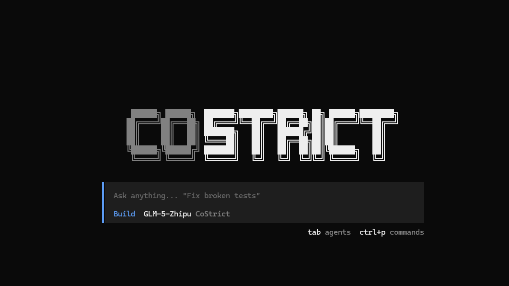

<p align="center">
    
</p>

<p align="center">
    <strong><a href="https://costrict.ai">CoStrict</a> AI 智能体移动优先的 Web 管理界面</strong>
</p>

<p align="center">
  
  
</p>

---

<p align="center">
  <a href="README.md">English</a> | <strong>中文</strong>
</p>

---

## 项目简介

CoStrict Manager 是一个现代化的 AI 智能体管理平台，提供移动优先的 Web 界面。支持在任何设备上管理、控制和编码 AI 智能体。

## 技术栈

### 后端
- **运行时**: [Bun](https://bun.sh/) - 高性能 JavaScript 运行时
- **框架**: [Hono](https://hono.dev/) - 轻量级、高性能 Web 框架
- **数据库**: Better SQLite3
- **验证**: Zod
- **认证**: Better Auth

### 前端
- **框架**: React 19 + TypeScript
- **构建工具**: Vite 7
- **UI 组件**: Radix UI + Tailwind CSS
- **状态管理**: React Query (@tanstack/react-query) + Zustand
- **表单**: React Hook Form + Zod
- **代码编辑**: Monaco Editor
- **Markdown**: React Markdown + Mermaid

### Monorepo 架构
- **包管理器**: pnpm (Workspace)
- **项目结构**: 
  - `backend/` - 后端 API 服务
  - `frontend/` - 前端 Web 应用
  - `packages/` - 共享包
  - `shared/` - 共享类型定义

## 快速开始

### 环境要求

- Node.js >= 18
- pnpm >= 10.28.1
- Bun >= 1.0

### Docker 部署（推荐）

```bash
# 克隆项目
git clone https://github.com/y574444354/costrict-manager.git
cd costrict-manager

# 复制环境配置
cp .env.example .env

# 启动服务
docker-compose up -d

# 访问应用
# 打开 http://localhost:5003
```

首次启动时，系统会提示创建管理员账户。

### 本地开发

```bash
# 安装依赖
pnpm install

# 复制环境配置
cp .env.example .env

# 启动开发服务器（前端 + 后端）
pnpm dev

# 或分别启动
pnpm dev:backend   # 后端服务：http://localhost:5003
pnpm dev:frontend  # 前端服务：http://localhost:5173
```

## 项目结构

```
costrict-manager/
├── backend/              # 后端服务
│   ├── src/             # 源代码
│   └── tests/           # 测试文件
├── frontend/            # 前端应用
│   ├── src/            # 源代码
│   │   ├── components/ # React 组件
│   │   ├── pages/      # 页面
│   │   ├── hooks/      # 自定义 Hooks
│   │   └── lib/        # 工具库
│   └── public/         # 静态资源
├── packages/            # Monorepo 包
│   └── memory/         # 内存管理模块
├── shared/             # 共享类型定义
├── scripts/            # 构建和部署脚本
└── docs/               # 文档
```

## 开发指南

### 常用命令

```bash
# 开发
pnpm dev              # 启动前后端开发服务器
pnpm dev:backend      # 仅启动后端
pnpm dev:frontend     # 仅启动前端

# 构建
pnpm build            # 构建所有模块
pnpm build:backend    # 构建后端
pnpm build:frontend   # 构建前端

# 测试
pnpm test             # 运行后端测试
cd backend && bun test <filename>  # 运行单个测试文件
cd backend && vitest --ui          # 测试 UI 界面
cd backend && vitest --coverage    # 测试覆盖率报告（80% 阈值）

# 代码质量
pnpm lint             # 检查前后端代码
pnpm lint:backend     # 仅检查后端
pnpm lint:frontend    # 仅检查前端
pnpm typecheck        # TypeScript 类型检查

# Docker
pnpm docker:build     # 构建 Docker 镜像
pnpm docker:up        # 启动容器
pnpm docker:down      # 停止容器
pnpm docker:logs      # 查看日志
```

### 代码规范

- **无注释**: 代码自文档化，不添加注释
- **无 console.log**: 使用 Bun 的 logger 或正确的错误处理
- **严格 TypeScript**: 完整的类型定义
- **命名导入**: 仅使用命名导入，如 `import { Hono } from 'hono'`
- **DRY 原则**: 不重复代码
- **SOLID 原则**: 遵循面向对象设计原则
- **YAGNI 原则**: 不保留不需要的代码

### 后端规范

- 使用 Hono 框架 + Zod 验证 + Better SQLite3
- try/catch 错误处理和结构化日志
- 遵循现有的 route/service/utility 结构
- 使用 async/await，避免 .then() 链
- 测试覆盖率要求：最低 80%

### 前端规范

- 使用 `@/` 别名导入组件：`import { Button } from '@/components/ui/button'`
- UI 组件：Radix UI + Tailwind CSS
- 表单处理：React Hook Form + Zod
- 状态管理：React Query
- 正确使用 React Hooks，禁止直接修改状态

## 功能特性

### 核心功能

- **Git 管理** — 多仓库支持、SSH 认证、Worktree、统一差异对比、PR 创建
- **文件管理** — 目录树浏览、语法高亮、创建/重命名/删除、ZIP 下载
- **智能对话** — 实时流式响应 (SSE)、斜杠命令、`@file` 文件引用、Plan/Build 模式、Mermaid 图表
- **语音功能** — 文本转语音（浏览器 + OpenAI 兼容）、语音转文本
- **AI 配置** — 模型选择、Provider 配置、Anthropic/GitHub Copilot OAuth、自定义 Agent 系统提示
- **MCP 支持** — 本地和远程 MCP 服务器支持，预置模板
- **知识记忆** — 持久化项目知识、语义搜索、感知压缩

### 移动端优化

- 响应式 UI 设计
- PWA 可安装
- iOS 优化（键盘处理、滑动手势）
- 移动端友好的操作界面

## 配置说明

### 环境变量

```bash
# 生产环境必需
AUTH_SECRET=your-secure-random-secret  # 生成命令: openssl rand -base64 32

# 预配置管理员（可选）
ADMIN_EMAIL=admin@example.com
ADMIN_PASSWORD=your-secure-password

# 局域网/远程访问
AUTH_TRUSTED_ORIGINS=http://localhost:5003,https://yourdomain.com
AUTH_SECURE_COOKIES=false  # 使用 HTTPS 时设为 true

# 服务端口（默认配置）
BACKEND_PORT=5003    # 后端 API 端口
FRONTEND_PORT=5173   # 前端开发服务器端口
```

### Docker 配置

项目包含完整的 Docker 支持：

- `Dockerfile` - 多阶段构建镜像
- `docker-compose.yml` - 容器编排配置
- `.dockerignore` - 构建排除配置

## 截图展示

<table>
<tr>
<td align="center"><strong>移动端对话</strong><br/></td>
<td align="center"><strong>移动端文件浏览</strong><br/></td>
<td align="center"><strong>差异对比视图</strong><br/></td>
</tr>
</table>

## 贡献指南

欢迎贡献代码！请查看 [CONTRIBUTING.md](CONTRIBUTING.md) 了解详情。

## 许可证

[MIT License](LICENSE)

---

## 🔗 链接

- **文档**: [https://chriswritescode-dev.github.io/costrict-manager/](https://chriswritescode-dev.github.io/costrict-manager/)
- **CoStrict 官网**: [https://costrict.ai](https://costrict.ai)
- **问题反馈**: [GitHub Issues](https://github.com/y574444354/costrict-manager/issues)

---

<p align="center">
  Made with ❤️ by the CoStrict Team
</p>
